>   GAMES103 - 基于物理的计算机动画入门 [链接](https://www.bilibili.com/video/BV12Q4y1S73g)

> 某些特殊写法的记录：
> - $\rm M$ 经常在公式中可以看到的质量矩阵，可以理解成 $\begin{bmatrix}m&0&\cdots&0\\0&m&\cdots&0\\\vdots&\vdots&\ddots&0\\0&0&0&m\end{bmatrix}=\rm m\rm I$ 这样的对角矩阵（这就一般就是3x3矩阵）
> - 一般用 $'$ 或者 $\rm^{new}$ 来表示变换后的状态
> - 老师的向量下标和之前的写法相反，可能是为了和向量的算法有关：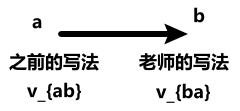

# 1. 刚体模拟
完全不会发生形变的物体，被称为**刚体**。

刚体的运动，以及随之而来的碰撞检测，此处主要提到了两个做法：

1. Impulse [维基百科](https://en.wikipedia.org/wiki/Impulse_(physics))
2. Shape Matching
## 1.1. Impulse
通过物理的方式，将物体视作一个整体。在于另一个物体进行碰撞时，基于选定的碰撞点进行受力分析，并根据计算得到的冲力 $\rm j$ 更新回物体的速度和角速度。

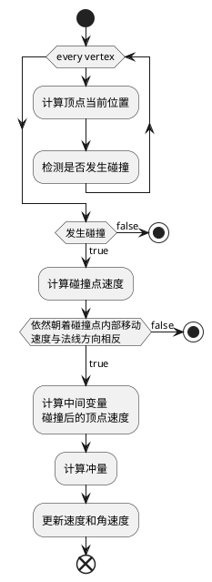
>  补充：
>  1.  计算顶点当前位置：$\rm x_{i}\leftarrow \rm x+\rm R\rm r_i$
>  2. 判断是否发生碰撞：$\phi(\rm x_i)<0$。这里是基于一种统一的边界值定义，在内部表示为 $\phi(\rm x)<0$；在外部表示为 $\phi(\rm x)>0$；在边界上表示为 $\phi(\rm x)=0$。
>  3. 计算碰撞点速度：$\rm v_i\leftarrow\rm v + \rm{\omega}\times\rm R\rm r_i$
>  4. 计算的碰撞后的顶点速度 $\rm v_i^{new}$：<br>$$\begin{aligned}\rm v_{N,i}&\leftarrow(\rm v_i\cdot N)N\\\rm v_{T,i}&\leftarrow\rm v_i-\rm v_{N,i}\\a&\leftarrow max(1-\mu_T(1+\mu_N)\frac{||\rm v_{N,i}||}{||\rm v_{T,i}||}, 0)\\\rm v_{N,i}^{new}&\leftarrow-\mu_N\rm v_{N,i}\\\rm v_{T,i}^{new}&\leftarrow a\rm v_{T,i}\\\rm v_i^{new}&\leftarrow\rm v_{N,i}^{new}+\rm v_{T,i}^{new}\end{aligned}$$
>  5. 计算冲量 $\rm j$：$$\begin{aligned}\rm K&\leftarrow\frac{1}{\rm M}-(Rr_i)^*I^{-1}(Rr_i)^*\\\rm j&\leftarrow\rm K^{-1}(\rm v_i^{new}-v_i)\end{aligned}$$其中的 $(Rr_i)^*$ 是将叉乘转换为矩阵乘法之后的产物<br>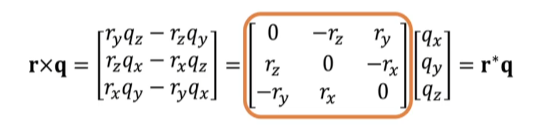$$\begin{aligned}\rm v_i^{new}&=\rm v_i+\frac{1}{\rm M}\rm j-(Rr_i)\times(I^{-1}(Rr_i\times\rm j))\\&=\rm v_i+\frac{1}{\rm M}\rm j-(Rr_i)^*I^{-1}(Rr_i)^*\rm j\\&\text{提取}\rm j\text{的参数命名为}\rm K\end{aligned}$$
>  6. 更新速度 $\rm v$ 和角速度 $\rm \omega$：$$\begin{aligned}\rm v&\leftarrow\rm v+\frac{1}{\rm M}\rm j\\\rm\omega&\leftarrow\rm\omega+I^{-1}(Rr_i\times\rm j)\end{aligned}$$
## 1.2. Shape Matching
不再基于物理的方式进行思考，使用一个简单的弹簧质点系统（只是类似，没看出有做过点与点之间的弹性计算），来进行分析。

在每次的运动模拟结束后，会通过约束的方式，消除其内部发生的形变。

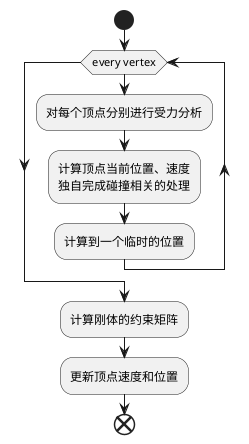

> 补充：
> 1. 此处顶点的位置命名为 $\rm x$ 中间临时位置命名为 $\rm y$
> 2. 计算刚体约束矩阵。计算中间状态时，质点模型和原刚体模型之间，变化最小的矩阵（维持重心位置，得到一个刚体模型移动到中间位置后最合适的旋转角度）$$\begin{aligned}\rm c&=\frac{1}{N}\sum_{i=0}^N\rm y_i\\[2ex]\rm A&=(\sum_{i=0}^N(\rm y_i-\rm c)\rm r_i^T)(\sum_{i=0}^N\rm r_i\rm r_j^T)^{-1}\\[2ex]\rm R&=PolarDecomposition(\rm A)\end{aligned}$$`Polar Decomposition`可以将矩阵拆分，得到唯一的$\rm RS$。<br>分别表示 $\rm R$ 旋转和 $\rm S$ 形变。
> 3. 更新速度（这里必须提一下是最开始对每个质点进行分析的时候，就计算过一次速度和位置，但那个只是一个中间值，所以当时的速度 $\rm v_i$ 和最后这里的 $\rm v_i$ 并不是同一个）$$\begin{aligned}\rm v_i&\leftarrow\frac{\rm c+\rm Rr_i-\rm x_i}{\Delta t}\\[2ex]\rm x_i&\leftarrow\rm c+\rm Rr_i\end{aligned}$$

# 2. 弹簧质点系统
将物体解构为很多的带质量的点，并通过之间的弹性线段连接来模拟物体的一种方式。

弹簧质点系统的优势在于其可以很好的与模型本身的顶点信息建立联系，通过对顶点信息进行数据分析，可以直接建立所需的质点系统。

## 2.1. 理想弹簧模型
弹簧的弹力与其形变量成正比，公式为：
$$\begin{aligned}E(x)&=\frac{1}{2}k(x-L)^2\\f(x)&=-\frac{dE}{dx}=-k(x-L)\end{aligned}$$
在三维空间中表示，使用 $x_i$ 和 $x_j$ 分别表示弹簧的两个点。可以得到以下关系：
$$\begin{aligned}E(x)&=\frac{1}{2}k(||x_i-x_j|| -L)^2\\f_i(x)&=-\nabla_iE=-k(||x_i-x_j|| -L)\frac{x_i-x_j}{||x_i-x_j||}\\f_j(x)&=-\nabla_jE=-k(||x_j-x_i||-L)\frac{x_j-x_i}{||x_j-x_i||}\\f_i&=-f_j\end{aligned}$$
> 其中的 $\nabla E$ 表示的是其梯度的导数 $(\frac{\partial E}{\partial x})^T$

## 2.2. 构建弹簧质点系统
结构化布局和非结构化布局的顶点布局，分别来构建弹簧质点系统。

- 结构化布局<br>指的是顶点布局很有规律的布局方式，比较经典的例子是平铺的正方形布局，顶点都在。<br>通常会按照以下的方式来添加弹簧：
	1. 对角连线（用于避免对角翻折）
	2. 直线上间隔一个顶点之间连线
- 非结构化布局<br>指的就是顶点布局不规律，由很多三角形随意拼接得到的较通用模型。<br>通常会按照以下的方式添加弹簧：
	1. 针对每条内部边，连接两侧的对角顶点

## 2.3. 弹簧质点系统的模拟流程


### 2.3.1. 显式积分模拟
大致可以整理为以下的步骤：

```python
# 遍历更新弹簧上的力
for s in spring_list:
	i, j, l = s   # 弹簧列表中将存储顶点的索引（i、j）以及弹簧原长（x）
	f = -k(||x_i - x_j|| - l) * (x_i - x_j) / (||x_i - x_j||)
	# 更新顶点上的受力
	f_i = f_i + f
	f_j = f_j - f

# 遍历顶点，更新顶点速度和位置
for vertex in vertex_list:
	v = v + t_delta / m * f  # 计算加速度（f/m）并乘上间隔时间（t_delta）
	x = x + t_delta * v      # 更新顶点位置
```

#### 2.3.1.1. 显式积分存在的问题
由于整个模拟的过程是离散的，在系数不合理的情况，可能会出现类似 `overshooting` 的情况。

如，在弹性系数 $\rm k$ 很大的时候，采样不足时，可能会出现，在基于一个初力后，弹簧再另一个方向延长过远；下一次模拟计算得到的力反而越来越大。这样的过程累加，最终导致弹簧系统被破坏。

在此处，如果弹性系数 $\rm k$ 很大，或者间隔时间 $\Delta\rm t$ 很大时，就容易出现这样的问题。

<a id=fnref-implicit-integral></a>
### 2.3.2. 隐式积分模拟
隐式积分对于当前系统而言，基于以下的公式：

$$
\begin{cases}\rm v_1 = v_0 + \Delta tM^{-1}f_1\\\rm x_1=x_0+\Delta tv_1\end{cases}
$$

通过将两个式子整合，消去其中的 $v_1$，并且假设是一直保持匀速运动得到的新位置，所以应该得到新的等式：
$$
\begin{cases}\rm x_1=x_0+\Delta tv_0 + \Delta t^2M^{-1}f_1\\\rm v_1=\cfrac{x_1-x_0}{\Delta t}\end{cases}
$$
> **拓展**<br>此处提到一个概念：<u>只与位置有关的力，被称为 `Holonomic`</u>

因为在弹簧系统中，所受到的力只与其所在的位置有关（形变量），因此可以对上式进行变形：其中的 $\rm f_1$ 也可以改成一个与 $\rm x_1$ 有关的力，写成 $\rm f(x_1)$。

通过这样的转换，就可以将等式变为一个关于 $\rm x_1$ 的方程。

> **TODO** 感觉还是下面这部分还是有点迷惑，之后再琢磨以下<br>其中的公式推导，目前来说，我只能认为这里出现的 $\rm F(x)$ 是基于这个问题来设计的另一个公式，它与原本想解决的 $\rm f(x)$ 之间的关系是：$\rm F(x)$ 的梯度等于 $\rm f(x)$。从而将原本的一个非线性方程转换为了求 $\rm F(x)$ 的最小值。

此处构建一个方程 $\rm F(x)=\cfrac{1}{2\Delta t^2}||x-x_0-\Delta tv_0||^2_M+E(x)$，将原本的非线性方程求解，转换为求 $\rm F(x)$ 的最小值。

> **补充**
> - 其中的特殊写法：$\rm||x||^2_M=x^TMx$
> - $E(x)$ 表示的是该系统中的能量，此处弹簧系统表示的就是弹性势能

#### 2.3.2.1. 牛顿法 Newton-Raphson Method
最初设计的目的就是用于求解非线性问题的最小值。使用牛顿法，至少需要保证函数连续（Lipschitz continuous）。（不然甚至没法求导）

牛顿法就是对函数进行求导，根据求导得到函数在当前位置上的斜率，通过斜率计算x轴交点，从而获得下一个点。重复这样的过程，直到找到一个最小值。伪代码如下：

```python
# 假定取了一个初始点 x_origin
x = x_origin
for _ in range(NUM_OF_CYCLES):  # 循环一定的次数
	k = F'(x)  # 对函数 F(x) 进行求导
	x = ...  # 使用 k 和 x 计算与x轴的焦点，并将其作为下一个 x 的值
```

> 牛顿法的使用很简单，但是其存在很多的限制，比如它并不能保证收敛。导致其在不同的初始值情况下，得到的结果可能都不相同。<br>在函数存在多个波谷（局部最优）值时，并不能保证牛顿法都能得到真正的最小值。<br>为了解决这个问题，可以引入二阶导，来判断函数是否存在多个波谷。（但是感觉没办法根除问题）

由于上方将问题转换为 $\rm x_1=argmin\text{ }\it F\rm(x)$，而后又将问题变为求 $F'\rm(x)=0$ 的值。利用泰勒展开（假设当前点为 $x_k$）：

$$
\begin{aligned}0=F'\rm(x)&\approx\nabla\it{F}\rm(x)+\cfrac{\partial\it{F}\rm^2(x)}{\partial x^2}(x-x_0)\\
&\begin{cases}\nabla\it{F}\rm(x)=\cfrac{1}{\rm\Delta t^2}\rm M(x-x_0-\Delta tv_0)-f(x)\\
\cfrac{\partial^2\it{F}\rm(x)}{\rm\partial x^2}=\cfrac{1}{\Delta\rm t^2}\rm M+H(x)\end{cases}\\
(\cfrac{1}{\Delta t^2}\rm M+H(x))\Delta x&=-\cfrac{1}{\Delta t^2}\rm M(x-x_0-\Delta tv_0)+f(x)
\end{aligned}
$$

> - 原式子中的 $\rm E(x)$ 关于距离的能量，对其求导后，得到的将是反向的力
> - $\rm H(x)$ 表示能量对位置的二阶导数（Hessian）$$\rm H_e=k\cfrac{x_{ij}x_{ij}^T}{||x_{ij}||^2}+k(1-\cfrac{L}{||x_{ij}||})(I-\cfrac{x_{ij}x_{ij}^T}{||x_{ij}||^2})$$
>> 具体推导在 P3 Lecture02 的PPT最后一页<br>这里涉及到一个等式 $\rm\cfrac{\partial||x||}{\partial x}=\cfrac{x^T}{||x||}$

将其中的 $\rm x-x_k$ 设为 $\rm\Delta x$，当 $\rm\Delta x$ 最小时，就说明已经取到了最低点。

## 2.4. 弹簧弯曲处理
在理想弹簧模型中，弹簧永远不会弯曲，这也导致了在模拟的过程中，对于弯曲的模拟终究还是与理想的效果存在一定的差异。

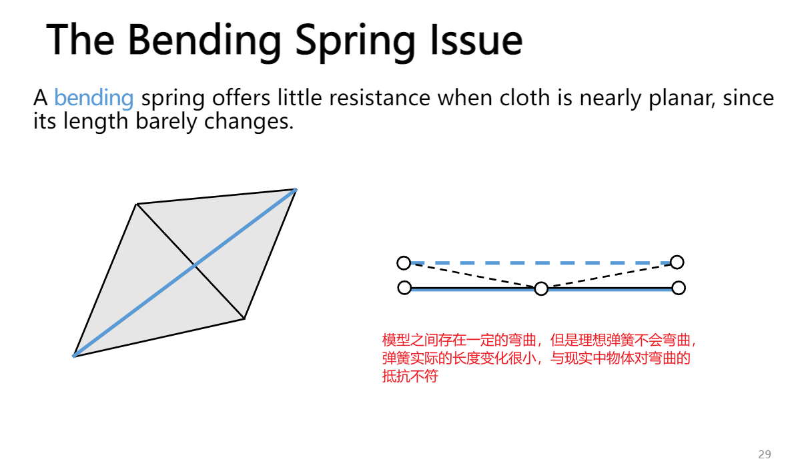

### 2.4.1. 二面角模型 A Dihedral Angle Model
> 此处的内容基本来自 Bridson et al. 2003. Simulation of Clothing with Folds and Wrinkles. SCA.

为了解决弯曲问题，引入额外的参数，定义弯折的夹角为 $\theta$，定义一个函数关系 $f(\theta)$ 来得到各个特定夹角时，各个顶点上将受到的力。

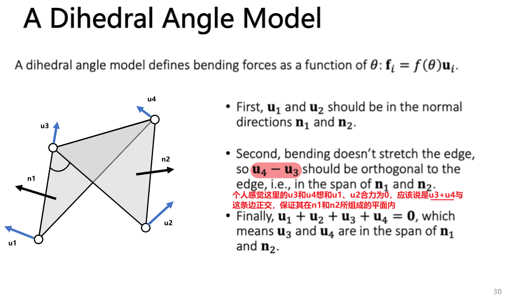
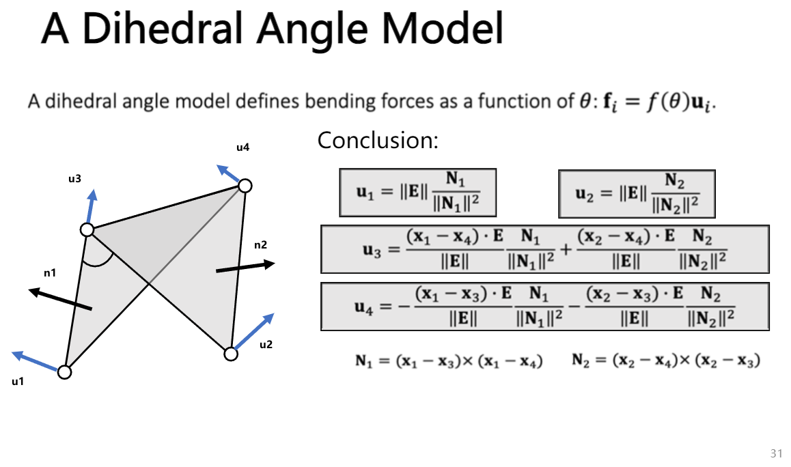
最终的力大小等式为：


#### 2.4.1.2. 存在的问题
全程使用的都是力来分析，隐式分析不好做<s>（不知道老师没说能量守恒问题，可能是不需要考虑？）</s>

### 2.4.2. 二次方弯曲模型 A Quadratic Bending Model
> 此处的内容来自 Bergou et al. 2006. A Quadratic Bending Model for Inextensible Surfaces. SCA.

二次方弯曲是一种通过能量推导的简单方式。

这个模型存在有两个假设：
1. 初始状态默认都在同一个平面
2. 模型内不能有太大的拉伸，主要用来处理弯曲

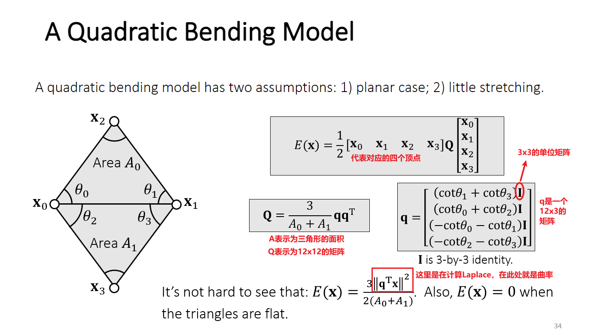

#### 2.4.2.1. 优点
该模型中的 $\rm Q$ 是一个常数矩阵，而且其中涉及到的重要数据计算都很方便：

$$\begin{aligned}\rm f(x)&=-\nabla E(x)=-Q\begin{bmatrix}\rm x_0\\\rm x_1\\\rm x_2\\\rm x_3\end{bmatrix}\\\rm H(x)&=\cfrac{\partial^2E(x)}{\partial x^2}=Q\end{aligned}$$

#### 2.4.2.2. 缺点
在不满足限制的情况下：
- 主要指网格变形（拉伸）比较严重时，模拟出的结果将与实际值偏差较大。
- 初始状态不是平面<br>但是还是有一定的方式可以解决，比如：
	- 优化的模型（Cubic shell model）
	- Projective dynamics model
	- Details skipped here

## 2.5. The Locking Issue

在现实生活中，存在很多面料它们虽然本身不易发生形变，但是却很容易发生弯折。

在弹簧支点模型中，为了表现面料本身不易发生形变，就会让原本的顶点边弹性系数较大（好像也不合适，可能直接固定长度比较合理），从而限制了非平行于这条边时的弯曲现象。

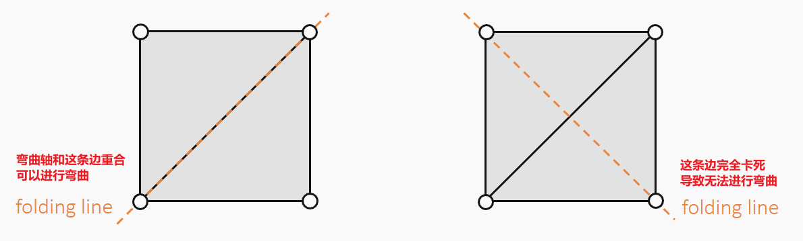

这个问题的本质，实际上是由于自由度的丢失导致的。

> **概念补充**<br>`manifold` 表示每条边都会有另一个与其共用的三角形，在这个基础上拓展每个三角形将于三条边相邻。这样的标准网格，被称为 `manifold`。

欧拉公式说明，说明该模型中的边的数量将等于：
$$
\rm n_{edges}=3n_{vertices}-3-n_{boundary-edges}
$$
> - $\rm n_{edges}$ 表示最后要求的边的总数
> - $\rm n_{vertices}$ 表示网格中顶点的总数
> - $\rm n_{boundary-edges}$ 表示在边界上的边的数量

而这里的自由度，就是自由的边的数量，也就是：$$\rm 3+n_{boundary-edges}$$

> (Optional) English and Bridson. 2008. Animating Developable Surface Using Nonconforming Elements. SIGGRAPH.<br>解决这个问题的一个思路（但是做法比较特殊），原本控制顶点改为控制边，来避免自由度被限制

## 2.6. 投影方法
用于应对目前基于物理模拟中，不好处理的一系列问题。如，现实世界中，很多的物体与理想弹簧模型差异依然比较明显，无法只通过一个弹性系数来模拟出很好的效果；物理模拟在应对较大/小的弹性系数时，没有很高效的解决方法，只能一般是通过显式积分缩短/增大步长，隐式积分增加/减少迭代，来实现。

现在希望可以有一种快速简单的方式，来实现整个过程的模拟，因此便有了此处的投影方法（PD）。

> 顺带一提，之前的物理模拟，一般被称为 **PBA**（Physically based Animation）

### 2.6.1. 基础概念
在 PBD 中，涉及到的一些基础的概念。

- **约束** Constraint<br>通常使用 $\rm\phi(x)$ 表示。而在理想弹簧模型中，约束通常可以直接表示为 $\rm\phi(x)=||x_i-x_j||-L=0$ 表示该模型一直会有将弹簧还原到原长的趋势。
- **约束范围**（有效范围）<br>通常使用 $\Omega$ 表示。在该模型中，通常可以表示为 $\rm\Omega=\{x\in R^6:\phi(x)=0\}$（因为这里是两个顶点，所以是6维）。
- **投影**（约束这个动作）<br>表示将约束范围外的值，压缩到约束范围内，并且保证约束修改的值最小。

通过上方的概念，可以整理出一下的数学问题：
$$\rm\{x_i^{new},x_j^{new}\}=argmin^{\cfrac{1}{2}}\{m_i||x_i^{new}-x_j||^2+m_j||x_j^{new}-x_j||^2\}$$

可以理解为：
$$\begin{gathered}\rm x^{new}\leftarrow Projection(x)\\\rm x_i^{new}\leftarrow x_i-\cfrac{m_j}{m_i+m_j}(||x_i-x_j||-L)\cfrac{x_i-x_j}{||x_i-x_j||}\\\rm x_j^{new}\leftarrow x_j+\cfrac{m_i}{m_i+m_j}(||x_i-x_j||-L)\cfrac{x_i-x_j}{||x_i-x_j||}\end{gathered}$$
> 最后的投影还考虑到了质量的影响，质量越大的点，受到的影响（投影的移动）越小；相对的，质量越大的点，受到的影响越大。

### 2.6.2. 处理流程
对于一个弹簧的模拟，就是直接一步到位。对于多个弹簧的组合系统，会有以下的处理方法。

#### 2.6.2.1. Gauss-Seidel方法
总体就一个思路，遍历弹簧，对各个弹簧进行更新，但是只是遍历一轮还是不够，因此就会涉及到多次的遍历。使用伪代码表示如下：

```python
# 总共循环K次，对整个弹簧系统进行遍历
for k in range(K):
	# 遍历每条边
	for edge in edges:
		... # 更新每条边的两个顶点的位置
```

> 虽然这个方法被命名为数学中的同名方法，但实际的使用方式更像是机器学习中的 `stochastic gradient descent`（随机梯度下降）

> **存在的问题**
> 1. 最终模拟的结果，一定程度上将会与边的顺序有关
> 2. 边的顺序将会影响收敛的速度

#### 2.6.2.2. Jacobi方法
为了避免 Gauss-Seidel 方法中存在的，模拟受到边的顺序影响的问题。同时，也是为了可以更好实现计算的并行。

与 Gauss-Seidel 方法相比，会先对每个顶点独立进行一次计算，然后整合数据进行一次投影。使用伪代码表示如下：

```python
# 总共循环K次，对整个系统进行遍历
for k in range(K):
	# 初始化临时顶点位置
	for vertex in vertices:
		temp_x_i = 0
		n_i = 0
		
	# 更新各个边
	for edge in edges:
		# 对边的两个顶点计算投影值
		temp_x_i = temp_x_i + ...  # 累加目标投影位置
		n_i += 1  # 两个顶点的权重自增1

	# 使用权重，得到最终投影的位置
	for vertex in vertices:
		# 这里一定程度上受到原始位置的影响（说是按照权重，可能是一个用户设定的值）
		x_i = (temp_x_i + k * x_i) / (n_i + k)
```

> **存在的问题**<br>收敛速度会更慢

### 2.6.3. Position based dynamics
**PBD**，Position based dynamics，是一种基于投影方法的改进。

导致的流程有点类似之前的 Shape Matching。大致模拟流程如下伪代码：

```python
# 在 PBD 模拟之前，会先分别进行独立的模拟
# 更新位置 x 和速度 v
...
# 开始 PBD 模拟
x_new = Projection(x)  # 使用投影的方式，更新一个临时的位置
v = v + (x_new - x) / dt  # 计算最后的速度
x = x_new   # 整合位置并更新
```

#### 2.6.3.1. 优点
- 容易并行实现
- 容易实现
- 通用性很强
- 在分辨率（这里的分辨率指的是顶点数量）较低的情况下效率较高
#### 2.6.3.2. 存在的问题
- PBD 不是一个基于物理的模拟方法，导致其模拟收敛的结果和网格数量（网格越多收敛越慢）、循环数（循环越多收敛越快）有关。同时收敛得越快，表现出的效果越硬。
- 高分辨率的情况下效率会迅速下降

#### 2.6.3.3. Strain limiting
Strain Limiting，可以理解为在原本的物理模拟基础上，使用了 PBD 来避免模拟过程中出现的大形变，使得最终的结果更加稳定。

> 实际的 Strain Limiting 出现比 PBD 早

在弹簧系统中使用的话，就可以定义一个拉升比，表示为当前长度除以原始长度：
$$\rm\sigma^{min}\le\cfrac{1}{L}||x_i-x_j||\le\sigma^{max}$$

> 其中的 $\rm x_i$ 和 $\rm x_j$ 依然表示两个顶点；$\rm L$ 表示为原长

此时的投影过程 $\rm x^{new}=Projection(x)$，就应该表示为：

$$\begin{aligned}\sigma&\leftarrow\cfrac{||x_i-x_j||}{L}\\\rm\sigma_o&\leftarrow min(max(\sigma,\sigma^{min}),\sigma^{max})\\\rm{x}_i^{new}&\leftarrow\rm{x}_i-\cfrac{m_j}{m_i+m_j}(||x_i-x_j||-\sigma_oL)\cfrac{x_i-x_j}{||x_i-x_j||}\\\rm{x}_j^{new}&\leftarrow\rm{x}_j+\cfrac{m_i}{m_j+m_i}(||x_i-x_j||-\sigma_oL)\cfrac{x_i-x_j}{||x_i-x_j||}\end{aligned}$$

> 按照这里的处理，可以理解 PBD 其实就是 $\sigma_o\equiv1$ 的情况

### 2.6.4. Projective Dynamics
Projective Dynamics 的目标，简而言之就是通过投影的方式来计算过程中的力，而不是直接更新顶点的位置。从而在一定程度上解决 PBD 中非物理的问题。

$$\begin{gathered}\rm\{x_{e,i}^{new},x_{e,j}^{new}\}=Projection_e(x_i,x_j)\\E(\rm{x})=\sum_{e=\{i,j\}}\cfrac{k}{2}\left|\left|(x_i-x_j)-(x_{e,i}^{new}-x_{e,j}^{new})\right|\right|^2\end{gathered}$$
> 其中的 $\rm e=\{i,j\}$ 表示弹簧，以及对应的两个索引

如果带入之前的投影等式：
$$\begin{aligned}E(\rm{x})&=\rm\sum_{e=\{i,j\}}\frac{k}{2}\left|\left|(x_i-x_j)-L_e\cfrac{x_i-x_j}{||x_i-x_j||}\right|\right|^2\\&=\rm\sum_{e=\{i,j\}}\frac{k}{2}\left|\left|||x_i-x_j||\cfrac{x_i-x_j}{||x_i-x_j||}-L_e\cfrac{x_i-x_j}{||x_i-x_j||}\right|\right|^2\\&=\rm\sum_{e=\{i,j\}}\frac{k}{2}(||x_i-x_j||-L_e)^2\end{aligned}$$

> 里面的 $\rm\cfrac{x_i-x_j}{||x_i-x_j||}$ 是一个单位向量，因此求到的 `magnitude` 为1

这里最终的能量等式，和原本的弹簧能量函数一模一样。而此时，就只需要让投影得到的顶点 $\rm x_{e,i}^{new}$ 和 $\rm x_{e,j}^{new}$ 作为了一个中间变量，帮助计算到此时的能量。

得到了能量的等式后，通过对 $\rm x$ 求导，得到的就是负的力：

$$\begin{aligned}\rm f_i=-\nabla_iE(x)&=-k\sum_{e=\{i,j\}}\rm(x_i-x_j)-(x_{e,i}^{new}-x_{e,j}^{new})\\&=-k\sum_{e=\{i,j\}}\rm(x_i-x_j)-L_e\cfrac{x_i-x_j}{||x_i-x_j||}\\&=-k\sum_{e=\{i,j\}}\rm(||x_i-x_j||-L_e)\cfrac{x_i-x_j}{||x_i-x_j||}\end{aligned}$$

通过上方的推导过程，发现其实此时模拟的力和能量与原本的弹簧模拟是一模一样。唯一的区别就是其中引入了两个中间变量。

这样转换的意义，可以将 `Hessian` 矩阵（二阶导数）变得非常简单（常数矩阵），可以总结出以下的规则：
1. 对角上是对应的顶点 $nk\rm{I}$，其中 $n$ 等于顶点的连线
2. 其他位置对应的是具体的连线 $-nk$，根据横纵索引查连线（弹簧）是否存在，如果存在 $n=1$；否则，$n=0$。

剩余的模拟过程和之前的<a href=#fnref-implicit-integral>隐式积分</a>的模拟一样的。实际上，这个方法可以省略这个投影的过程，根据上方的 `Hessian` 规律直接推导（同时这个 `Hessian` 应当是一个常量），所以可以直接计算。

### 2.6.5. Constrained Dynamics
主要是希望可以解决之前的方法中，在希望实现比较强的约束时，只能提升迭代次数，而提升迭代次数又不可避免得带来了计算量上升。

> 这个方法一般用在刚体的某些模拟中，让它局限在一定的约束中，同时快速收敛

在此处，就会转换之前的等式。
$$E(\rm{x})=\sum_e\frac{\mathnormal{k}}{2}(||x_{e,i}-x_{e,j}||-\mathnormal{L}_e)^2=\cfrac{1}{2}\Phi^T(x)C^{-1}\Phi(x)$$

> 这里的 $\Phi$ 还是表示弹簧的约束整合（指 $\Phi$ 的向量长度应该和约束的数量相等）$\rm\Phi_e(x)=||x_{e,i}-x_{e,j}||-\mathnormal{L}_e$
> 其中的 $\rm C$ 表示的是柔软度矩阵（Compliant matrix，大小是约束数量 $E\times E$）

将这个等式转为关于约束的等式后，力也需要进行转换（因为能量不再是和距离有关，所以需要转换）

$$f(\rm x)=-\nabla E=-\left(\cfrac{\partial E}{\partial\Phi}\cfrac{\partial\Phi}{\partial x}\right)^T=-J^TC^{-1}\Phi=J^T\lambda$$
> 这里的 $\cfrac{\partial E}{\partial\Phi}$ 可以参考上方能量等式的最终推导结果，对它求导就会等于 $\rm C^{-1}\Phi$<br>同时$\rm J=\cfrac{\partial\Phi}{\partial x}$

通过上方的转换，额外引入了一个参数 $\rm\lambda=C^{-1}\Phi$，因此这个等式变成了两个变量的求导。

根据隐式积分，我们将得到（动量守恒）：
$$\rm Mv^{new}-\Delta\mathnormal{t}J^T\lambda^{new}=Mv$$
同时，由 $\lambda$ 的定义，可以得到：
$$\rm C\lambda^{new}=-\Phi^{new}\approx-\Phi-J(x^{new}-x)\approx-\Phi-\Delta\mathnormal{t}Jv^{new}$$

整合两个公式，形成矩阵，表示为：
$$\begin{bmatrix}\rm M&-\Delta\mathnormal{t}\rm{J^T}\\\Delta\mathnormal{t}\rm{j}&\rm{C}\end{bmatrix}\begin{bmatrix}\rm{v^{new}}\\\rm\lambda^{new}\end{bmatrix}=\begin{bmatrix}\rm{Mv}\\-\Phi\end{bmatrix}$$

# 3. 有限元/有限体积
- The linear finite element method (FEM，有限元)
- The finite volume method (FVM，有限体积)

## 3.1. FEM
有限元的思想，主要就是希望可以通过一种方式，来表示某种变化前后，图案内，所有位置的变化趋势。

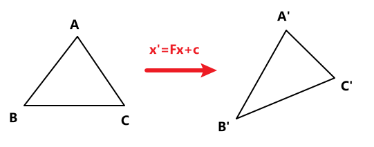

 其中 **$\rm F$ （deformation gradient，形变梯度 $\rm\partial{x'}/\partial{x}$）表示旋转和缩放的矩阵（线性）**，$\rm c$ 表示偏移量的向量（非线性）

根据以上的关系，进行推导：
$$\begin{aligned}\rm x_{ab}^{new}&=x_a^{new}-x_b^{new}\\[2ex]&=\rm(Fx_a+c)-(F_b+c)\\[2ex]&=\rm Fx_{ab}\end{aligned}$$

因此满足这个关系的范围内的向量，前后也将满足 $\rm F$ 矩阵的转换关系。同时，也可以推导出矩阵的计算：
$$\rm F=\begin{bmatrix}\rm{x}_{10}^{new}&\rm{x}_{20}^{new}\end{bmatrix}\begin{bmatrix}\rm{x}_{10}&\rm{x}_{20}\end{bmatrix}^{-1}$$

### 3.1.1. Green Strain
> 此处引入一个概念 `Strain`，表示为 $\rm G$。具有以下的性质。
> - 表示形变，如果没有发生形变时，$\rm G=0$。当形变量增加，$\rm||G||$ 变大。
> - 最终会变成三个独立的量。在这里就写成 $\xi_{uu}$、$\xi_{uv}$、$\xi_{vv}$。
> - $\rm G$ 与旋转无关。

在上方的推导中，最后得到了变换的矩阵 $\rm{F}$，但这还不是最后需要的形变矩阵，其中有额外的旋转变换。现在的目标，就是通过某种手段，消除其中的旋转。

> 感觉这里的 “形变” 可能有点歧义，必须结合之前的 SVD 分解，其中将任意的缩放，理解为 $\rm UDV^T$，而这里只有前两步 $\rm DV^T$ 和形变有关，如下图：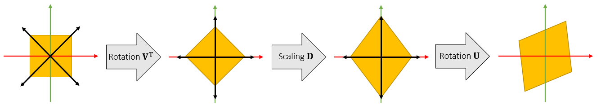
> 这里的目的，就是希望把这里无关的 $\rm{U}$ 给去掉，而不是真的把所有的旋转给去掉。

为了解决这个问题，数学家提供了一个公式 Green Strain，直接消去其中的 $\rm{U}$：
$$\rm G=\frac{1}{2}(F^TF-I)=\frac{1}{2}(VD^2V^T-I)=\begin{bmatrix}\xi_{uu}&\xi_{uv}\\\xi_{uv}&\xi_{vv}\end{bmatrix}$$
> 这里的 $\rm F^TF$，展开后就是 $\rm VDU^TUDV^T$。其中 $\rm D$ 转置后等于本身，而旋转矩阵是线性矩阵导致转置等于它的逆，所以这里的 $\rm U^TU$ 会直接抵消。

### 3.1.2. 能量密度函数
此处定义了一个函数 $W(\rm{G})$，通过 strain 来表示能量的密度。因此，最终能量等式表示为：
$$E=\int W(\rm{G})\mathnormal{d}A=A^{ref}\mathnormal{W}(\mathnormal{\xi_{uu},\xi_{vv},\xi_{uv}})$$
> $\rm A^{ref}$ 表示还未发生形变前的面积

> 此处引入 $W(\rm{G})$模型（比较少见） The Saint Venant-Kirchhoff Model (StVK)
> $$W(\xi_{uu},\xi_{vv},\xi_{uv})=\cfrac{\lambda}{2}(\xi_{uu}+\xi_{vv})^2+\mu(\xi_{uu}^2+\xi_{vv}^2+2\xi_{uv}^2)$$

此处对 $W(\rm{G})$ 求导：
$$\begin{aligned}\cfrac{\partial W}{\partial\rm G}&=\begin{bmatrix}\cfrac{\partial W}{\partial \xi_{uu}}&\cfrac{1}{2}\cfrac{\partial W}{\partial\xi_{uv}}\\\cfrac{1}{2}\cfrac{\partial W}{\partial\xi_{uv}}&\cfrac{\partial W}{\partial\xi_{vv}}\end{bmatrix}\\[2ex]&=\begin{bmatrix}2\mu\xi_{uu}+\lambda\xi_{uu}&2\mu\xi_{uv}\\2\mu\xi_{uv}&2\mu\xi_{vv}+\lambda\xi_{vv}\end{bmatrix}\\[2ex]&=2\mu\mathnormal{G}+\lambda\operatorname{trace}(\mathnormal{G})\rm{I}=S\end{aligned}$$

> - $\operatorname{trace}(\rm{G})$ 表示矩阵 $\rm{G}$ 的主对角和（矩阵的迹）
> - 计算得到的矩阵 $\rm{S}$ 表示 Second Piola-Kirchhoff stress tensor, something about force
> - 最后计算得到的值与力有关，但是并不是力（有点类似力的密度？）

### 3.1.3. 受力公式
$$\begin{aligned}\rm f_\mathnormal{i}=-\left(\cfrac{\partial\mathnormal{E}}{\partial x_i}\right)^T&=-A^{ref}\left(\cfrac{\partial\mathnormal{W}}{\partial \rm{x}_i}\right)^T\\&=-A^{ref}\left(\cfrac{\partial W}{\partial\xi_{uu}}\cfrac{\partial\xi_{uu}}{\partial \rm{x}_i}+\cfrac{\partial W}{\partial\xi_{vv}}\cfrac{\partial\xi_{vv}}{\partial\rm{x}_i}+\cfrac{\partial W}{\partial\xi_{uv}}\cfrac{\partial\xi_{uv}}{\partial \rm{x}_i}\right)\end{aligned}$$

此处涉及到 $\cfrac{\partial W}{\partial\xi_{uu}}$、$\cfrac{\partial W}{\partial\xi_{vv}}$、$\cfrac{\partial W}{\partial\xi_{uv}}$ 其实就在之前计算到的 $\rm{S}$ 矩阵中可以直接拿到。但 $\cfrac{\partial\xi_{uu}}{\partial\rm{x_i}}$、$\cfrac{\partial\xi_{vv}}{\partial\rm{x_i}}$、$\cfrac{\partial\xi_{uv}}{\partial\rm{x_i}}$ 还是不知道。

此处将使用到之前的形变梯度（$\rm F$，Deformation gradient）：
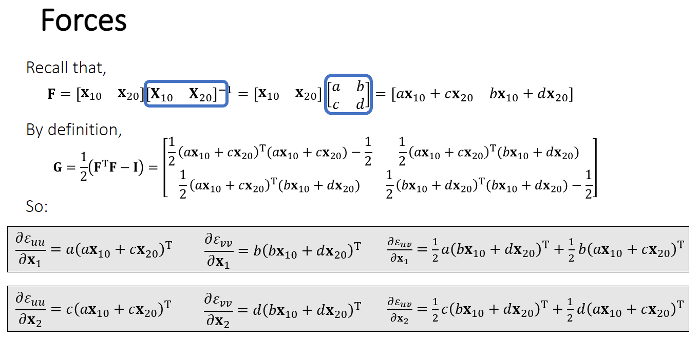

对上方的式子进行简化：
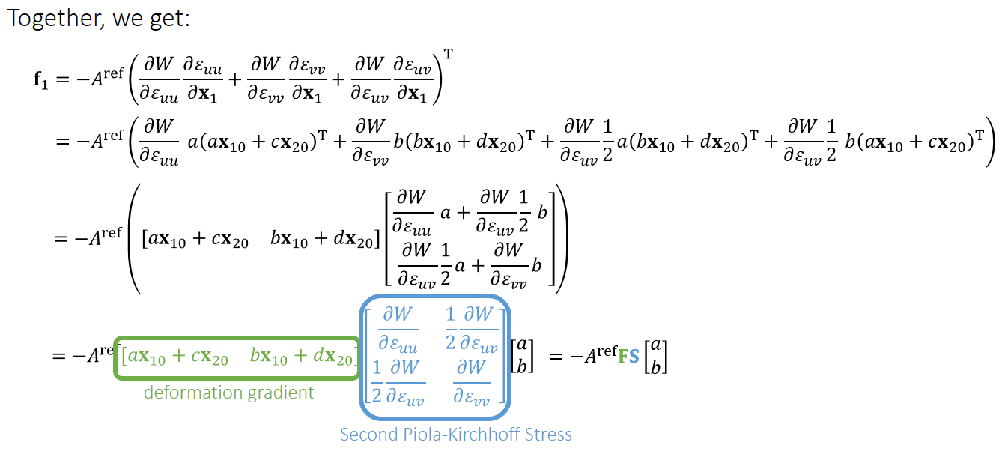

因此，之前求三角形上的力，可以直接整理为一个公式
$$\begin{bmatrix}\rm{f_1}&\rm{f_2}\end{bmatrix}=-A^{ref}\rm{FS}\begin{bmatrix}\rm{r_{10}}&\rm{r_{20}}\end{bmatrix}$$

根据牛顿定律系统合力（内力）为零，因此最后的 $\rm f_0=-f_1-f_2$。

## 3.2. FVM
有限体积，Finite Volume Method，在对于三角形、四面体这种简单的线性的情况，本质上与有限元方法是等价的。

在 FVM 中，定义两个物体/图元之间的切分面/线上，单位面积/单位长度上受到的力为牵引力（traction），因此，这个面/线上力的总和就可以表示为：
$$\rm f=\oint_Lt\mathnormal{dl}$$

> - $L$ 表示这个切分面/线的总面积/长度
> - $\rm t$ 表示牵引力（traction）

此外还引入了一个变量：Stress tensor 矩阵 $\sigma$。表示任意位置上法线 $\rm n$ 到 $\rm t$ 的转化

因此，力的公式转换为：
$$\rm f=\oint_L\sigma\rm n\mathnormal{dl}$$

### 3.2.1. 映射的比较
在 FEM 中，出现过 $\rm S$ 矩阵表示一种在稳定状态下，法线 $\rm N$ 到 traction 的转化关系（当时说类似力的密度，对应的其实就是这里的 traction 定义）

而 FVM 中，$\sigma$ 矩阵是用于计算法线 $\rm n$ 到 $\rm t$ 的投影矩阵。同时，$\sigma$ 是基于**形变后**的状态时，对应的映射关系。

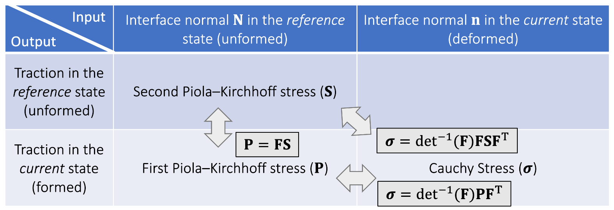

> 这里还补充了一个比较特殊的 stress 矩阵 $\rm P$，用于从稳定状态的 $\rm n$ 转换到形变后的 traction

之前，已经推导出了应该如何求到 $\rm S$ 矩阵，现在就需要一种方法，来进一步推导得到 $\sigma$ 矩阵。

1. $\rm S\rightarrow P$<br>从 $\rm{S}$ 到 $\rm{P}$ 只需要乘上之前的**形变梯度**（Deformation gradient）即可（因为力是矢量，同样可以按照形变梯度的定义进行转化）
2. $\rm P\rightarrow\sigma$<br>具体推导可以看PPT Lecture-07 P19~P20

### 3.2.2. 受力公式

将之前的概念带入到三角形中，可以进行一下的推导：
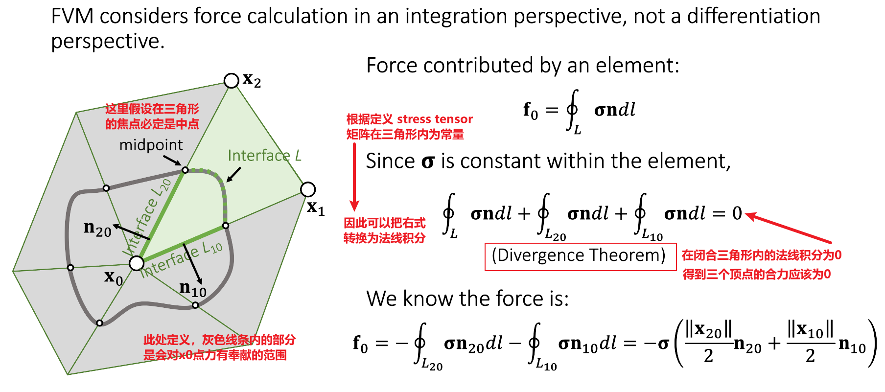

> 其中 $\sigma$ 在各个三角形内部不同，所以中心的合力不一定是0

对四面体而言，就是变为求体积，基本同理，区别是最后的公式是 $\cfrac{A}{3}$ 表示要均分到内部的另外三个顶点。

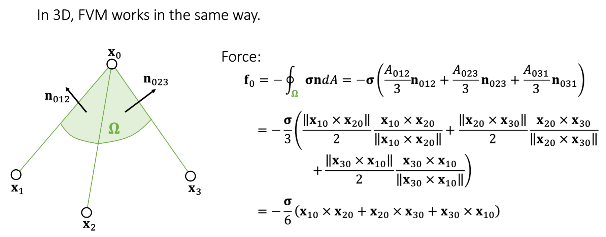

之后根据几种映射的关系（3.2.1. 映射的比较），可以对公式进一步推导：

$$\begin{aligned}\rm f_0&=-\cfrac{\sigma}{6}\rm(x_{10}^{new}\times x_{20}^{new}+x_{20}^{new}\times x_{30}^{new}+x_{30}^{new}\times x_{10}^{new})\\[2ex]&=-\rm\cfrac{P}{6}\underbrace{(x_{10}\times x_{20}+x_{20}\times x_{30}+x_{30}\times x_{10})}_{\text{Constant, can be precomputed}}\\[2ex]&=-\rm\cfrac{FS}{6}b_0\end{aligned}$$

> 这里通过将 $\sigma$ 转化为 $\rm P$，使得原本需求的形变后的法线变为了形变前的法线，这使得后面的大块计算变为了可以预计算得到的常量<br>$\rm b_0$ 表示的就是上面的常量 $\rm(x_{10}\times x_{20}+x_{20}\times x_{30}+x_{30}\times x_{10})$（其他的，$\rm b_1$、$\rm b_2$ 代表的都是对应顶点的相邻的三个面上的法线）

### 3.2.3. 公式简化
> 参考图：<br>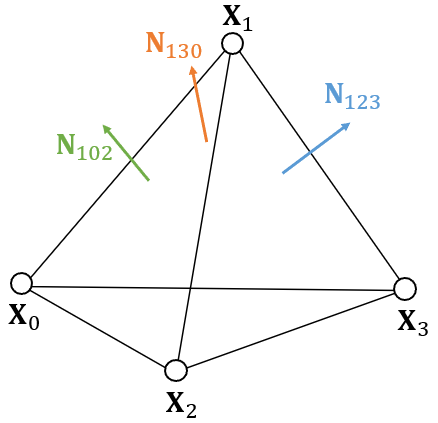

根据之前的推导，可以发现这样的关系：
$$\begin{aligned}\rm x_{10}^Tb_1&=\rm x_{10}^T(x_{01}\times x_{21}+x_{21}\times x_{31}+x_{31}\times x_{01})\\&\rm=x_{10}^T(x_{21}\times x_{31})=x_{01}^T(x_{31}\times x_{21})=6\operatorname{Vol}\end{aligned}$$

> 其中 $\rm x_{01}\times x_{21}$ 和 $\rm x_{31}\times x_{01}$ 都将会和01这条边叉乘，得到的肯定垂直于01边，那之后再与外面的 $\rm x_{10}^T$ 相乘也必然等于0，这里就直接消除。<br>$\operatorname{Vol}$ 表示的是四面体的体积

之后，还有：
$$\begin{aligned}\rm x_{20}^Tb_1&\rm=x_{20}^T(x_{01}\times x_{21}+x_{21}\times x_{31}+x_{31}\times x_{01})\\&\rm=x_{20}^T(x_{20}\times x_{10}+x_{20}\times x_{31})=0\end{aligned}$$

> 这里有一个推导：$$\begin{aligned}&\rm x_{21}\times x_{31}+x_{31}\times x_{01}\\=&\rm x_{21}\times x_{31}-x_{01}\times x_{31}\\=&\rm (x_{21}-x_{01})\times x_{31}\\=&\rm x_{20}\times x_{31}\end{aligned}$$

同理，可得：
$$\begin{aligned}\rm x_{30}^Tb_1&\rm=x_{30}^T(x_{01}\times x_{21}+x_{21}\times x_{31}+x_{31}\times x_{01})\\&\rm=x_{30}^T(x_{21}\times x_{30}+x_{10}\times x_{30})=0\end{aligned}$$

将这样的等式整理，变为矩阵乘法：
$$\begin{aligned}\rm\begin{bmatrix}\rm x_{10}&\rm x_{20}&\rm x_{30}\end{bmatrix}^Tb_1&=\begin{bmatrix}\rm x_{10}&\rm x_{20}&\rm x_{30}\end{bmatrix}^T(x_{01}\times x_{21}+x_{21}\times x_{31}+x_{31}\times x_{01})\\[2ex]&=\begin{bmatrix}6\operatorname{Vol}\\0\\0\end{bmatrix}\end{aligned}$$

类似的也有：
$$\begin{gathered}\rm\begin{bmatrix}\rm x_{10}&\rm x_{20}&\rm x_{30}\end{bmatrix}^Tb_2=\begin{bmatrix}0\\6\operatorname{Vol}\\0\end{bmatrix}\end{gathered}$$

## 3.3. 整体的框架

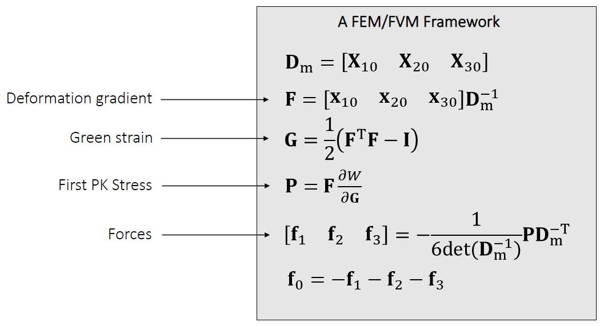

# 附加内容

> 课后阅读记录

- 数学公式的推导 [MatrixCalculusCookbook](https://www.math.uwaterloo.ca/~hwolkowi/matrixcookbook.pdf)
- Bridson et al. 2003. Simulation of Clothing with Folds and Wrinkles. SCA. (P6)
- Baraff and Witkin. 1998. Large Step in Cloth Simulation. SIGGRAPH.
- Bergou et al. 2006. A Quadratic Bending Model for Inextensible Surfaces. SCA. (P6)
- English and Bridson. 2008. Animating Developable Surface Using Nonconforming Elements. SIGGRAPH. (P6)
- Muller. 2008. Hierarchical Position Based Dynamics. VRIPHYS. (P6)
- Tournier et al. 2015. Stable Constrained Dynamics. TOG. (P7)
- Volino et al. 2009. A simple approach to nonlinear tensile stiffness for accurate cloth simulation. TOG. (P7)
- Teran et al. 2003. Finite Volume Methods for the Simulation of Skeleton Muscles. SCA. (P8)