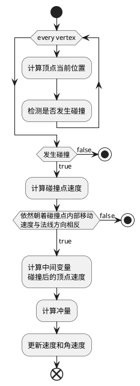
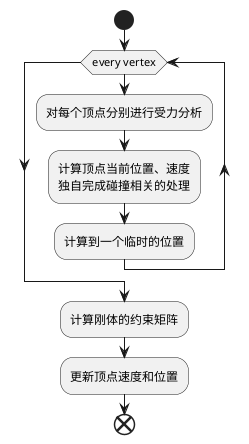

>   GAMES103 - 基于物理的计算机动画入门 [链接](https://www.bilibili.com/video/BV12Q4y1S73g)

> 某些特殊写法的记录：
> - $\rm M$ 经常在公式中可以看到的质量矩阵，可以理解成 $\begin{bmatrix}m&0&\cdots&0\\0&m&\cdots&0\\\vdots&\vdots&\ddots&0\\0&0&0&m\end{bmatrix}=\rm m\rm I$ 这样的对角矩阵（这就一般就是3x3矩阵）

# 1. 刚体模拟
完全不会发生形变的物体，被称为**刚体**。

刚体的运动，以及随之而来的碰撞检测，此处主要提到了两个做法：

1. Impulse [维基百科](https://en.wikipedia.org/wiki/Impulse_(physics))
2. Shape Matching
## 1.1. Impulse
通过物理的方式，将物体视作一个整体。在于另一个物体进行碰撞时，基于选定的碰撞点进行受力分析，并根据计算得到的冲力 $\rm j$ 更新回物体的速度和角速度。


>  补充：
>  1.  计算顶点当前位置：$\rm x_\it{i}\leftarrow \rm x+\rm R\rm r_\it i$
>  2. 判断是否发生碰撞：$\phi(\rm x_i)<0$。这里是基于一种统一的边界值定义，在内部表示为 $\phi(\rm x)<0$；在外部表示为 $\phi(\rm x)>0$；在边界上表示为 $\phi(\rm x)=0$。
>  3. 计算碰撞点速度：$\rm v_i\leftarrow\rm v + \rm{\omega}\times\rm R\rm r_i$
>  4. 计算的碰撞后的顶点速度 $\rm v_i^{new}$：<br>$$\begin{align*}\rm v_{N,i}&\leftarrow(\rm v_i\cdot N)N\\\rm v_{T,i}&\leftarrow\rm v_i-\rm v_{N,i}\\a&\leftarrow max(1-\mu_T(1+\mu_N)\frac{||\rm v_{N,i}||}{||\rm v_{T,i}||}, 0)\\\rm v_{N,i}^{new}&\leftarrow-\mu_N\rm v_{N,i}\\\rm v_{T,i}^{new}&\leftarrow a\rm v_{T,i}\\\rm v_i^{new}&\leftarrow\rm v_{N,i}^{new}+\rm v_{T,i}^{new}\end{align*}$$
>  5. 计算冲量 $\rm j$：$$\begin{align*}\rm K&\leftarrow\frac{1}{\rm M}-(Rr_i)^*I^{-1}(Rr_i)^*\\\rm j&\leftarrow\rm K^{-1}(\rm v_i^{new}-v_i)\end{align*}$$其中的 $(Rr_i)^*$ 是将叉乘转换为矩阵乘法之后的产物<br>$$\begin{align*}\rm v_i^{new}&=\rm v_i+\frac{1}{\rm M}\rm j-(Rr_i)\times(I^{-1}(Rr_i\times\rm j))\\&=\rm v_i+\frac{1}{\rm M}\rm j-(Rr_i)^*I^{-1}(Rr_i)^*\rm j\\&\text{提取}\rm j\text{的参数命名为}\rm K\end{align*}$$
>  6. 更新速度 $\rm v$ 和角速度 $\rm \omega$：$$\begin{align*}\rm v&\leftarrow\rm v+\frac{1}{\rm M}\rm j\\\rm\omega&\leftarrow\rm\omega+I^{-1}(Rr_i\times\rm j)\end{align*}$$
## 1.2. Shape Matching
不再基于物理的方式进行思考，使用一个简单的弹簧质点系统（只是类似，没看出有做过点与点之间的弹性计算），来进行分析。

在每次的运动模拟结束后，会通过约束的方式，消除其内部发生的形变。



> 补充：
> 1. 此处顶点的位置命名为 $\rm x$ 中间临时位置命名为 $\rm y$
> 2. 计算刚体约束矩阵。计算中间状态时，质点模型和原刚体模型之间，变化最小的矩阵（维持重心位置，得到一个刚体模型移动到中间位置后最合适的旋转角度）$$\begin{align*}\rm c&=\frac{1}{N}\sum_{i=0}^N\rm y_i\\[2ex]\rm A&=(\sum_{i=0}^N(\rm y_i-\rm c)\rm r_i^T)(\sum_{i=0}^N\rm r_i\rm r_j^T)^{-1}\\[2ex]\rm R&=PolarDecomposition(\rm A)\end{align*}$$`Polar Decomposition`可以将矩阵拆分，得到唯一的$\rm RS$。<br>分别表示 $\rm R$ 旋转和 $\rm S$ 形变。
> 3. 更新速度（这里必须提一下是最开始对每个质点进行分析的时候，就计算过一次速度和位置，但那个只是一个中间值，所以当时的速度 $\rm v_i$ 和最后这里的 $\rm v_i$ 并不是同一个）$$\begin{align*}\rm v_i&\leftarrow\frac{\rm c+\rm Rr_i-\rm x_i}{\Delta t}\\[2ex]\rm x_i&\leftarrow\rm c+\rm Rr_i\end{align*}$$

# 2. 弹簧质点系统
将物体解构为很多的带质量的点，并通过之间的弹性线段连接来模拟物体的一种方式。

弹簧质点系统的优势在于其可以很好的与模型本身的顶点信息建立联系，通过对顶点信息进行数据分析，可以直接建立所需的质点系统。

## 2.1. 理想弹簧模型
弹簧的弹力与其形变量成正比，公式为：
$$\begin{aligned}E(x)&=\frac{1}{2}k(x-L)^2\\f(x)&=-\frac{dE}{dx}=-k(x-L)\end{aligned}$$
在三维空间中表示，使用 $x_i$ 和 $x_j$ 分别表示弹簧的两个点。可以得到以下关系：
$$\begin{aligned}E(x)&=\frac{1}{2}k(||x_i-x_j|| -L)^2\\f_i(x)&=-\nabla_iE=-k(||x_i-x_j|| -L)\frac{x_i-x_j}{||x_i-x_j||}\\f_j(x)&=-\nabla_jE=-k(||x_j-x_i||-L)\frac{x_j-x_i}{||x_j-x_i||}\\f_i&=-f_j\end{aligned}$$
> 其中的 $\nabla E$ 表示的是其梯度的导数 $(\frac{\partial E}{\partial x})^T$

## 2.2. 构建弹簧质点系统
结构化布局和非结构化布局的顶点布局，分别来构建弹簧质点系统。

- 结构化布局<br>指的是顶点布局很有规律的布局方式，比较经典的例子是平铺的正方形布局，顶点都在。<br>通常会按照以下的方式来添加弹簧：
	1. 对角连线（用于避免对角翻折）
	2. 直线上间隔一个顶点之间连线
- 非结构化布局<br>指的就是顶点布局不规律，由很多三角形随意拼接得到的较通用模型。<br>通常会按照以下的方式添加弹簧：
	1. 针对每条内部边，连接两侧的对角顶点

## 2.3. 弹簧质点系统的模拟流程


### 2.3.1. 显式积分模拟
大致可以整理为以下的步骤：

```python
# 遍历更新弹簧上的力
for s in spring_list:
	i, j, l = s   # 弹簧列表中将存储顶点的索引（i、j）以及弹簧原长（x）
	f = -k(||x_i - x_j|| - l) * (x_i - x_j) / (||x_i - x_j||)
	# 更新顶点上的受力
	f_i = f_i + f
	f_j = f_j - f

# 遍历顶点，更新顶点速度和位置
for vertex in vertex_list:
	v = v + t_delta / m * f  # 计算加速度（f/m）并乘上间隔时间（t_delta）
	x = x + t_delta * v      # 更新顶点位置
```

#### 2.3.1.1. 显式积分存在的问题
由于整个模拟的过程是离散的，在系数不合理的情况，可能会出现类似 `overshooting` 的情况。

如，在弹性系数 $\rm k$ 很大的时候，采样不足时，可能会出现，在基于一个初力后，弹簧再另一个方向延长过远；下一次模拟计算得到的力反而越来越大。这样的过程累加，最终导致弹簧系统被破坏。

在此处，如果弹性系数 $\rm k$ 很大，或者间隔时间 $\Delta\rm t$ 很大时，就容易出现这样的问题。

### 2.3.2. 隐式积分模拟
隐式积分对于当前系统而言，基于以下的公式：

$$
\begin{cases}\rm v_1 = v_0 + \Delta tM^{-1}f_1\\\rm x_1=x_0+\Delta tv_1\end{cases}
$$

通过将两个式子整合，消去其中的 $v_1$，并且假设是一直保持匀速运动得到的新位置，所以应该得到新的等式：
$$
\begin{cases}\rm x_1=x_0+\Delta tv_0 + \Delta t^2M^{-1}f_1\\\rm v_1=\cfrac{x_1-x_0}{\Delta t}\end{cases}
$$
> **拓展**<br>此处提到一个概念：<u>只与位置有关的力，被称为 `Holonomic`</u>

因为在弹簧系统中，所受到的力只与其所在的位置有关（形变量），因此可以对上式进行变形：其中的 $\rm f_1$ 也可以改成一个与 $\rm x_1$ 有关的力，写成 $\rm f(x_1)$。

通过这样的转换，就可以将等式变为一个关于 $\rm x_1$ 的方程。

> **TODO** 感觉还是下面这部分还是有点迷惑，之后再琢磨以下<br>其中的公式推导，目前来说，我只能认为这里出现的 $\rm F(x)$ 是基于这个问题来设计的另一个公式，它与原本想解决的 $\rm f(x)$ 之间的关系是：$\rm F(x)$ 的梯度等于 $\rm f(x)$。从而将原本的一个非线性方程转换为了求 $\rm F(x)$ 的最小值。

此处构建一个方程 $\rm F(x)=\cfrac{1}{2\Delta t^2}||x-x_0-\Delta tv_0||^2_M+E(x)$，将原本的非线性方程求解，转换为求 $\rm F(x)$ 的最小值。

> **补充**
> - 其中的特殊写法：$\rm||x||^2_M=x^TMx$
> - $E(x)$ 表示的是该系统中的能量，此处弹簧系统表示的就是弹性势能

#### 2.3.2.1. 牛顿法 Newton-Raphson Method
最初设计的目的就是用于求解非线性问题的最小值。使用牛顿法，至少需要保证函数连续（Lipschitz continuous）。（不然甚至没法求导）

牛顿法就是对函数进行求导，根据求导得到函数在当前位置上的斜率，通过斜率计算x轴交点，从而获得下一个点。重复这样的过程，直到找到一个最小值。伪代码如下：

```python
# 假定取了一个初始点 x_origin
x = x_origin
for _ in range(NUM_OF_CYCLES):  # 循环一定的次数
	k = F'(x)  # 对函数 F(x) 进行求导
	x = ...  # 使用 k 和 x 计算与x轴的焦点，并将其作为下一个 x 的值
```

> 牛顿法的使用很简单，但是其存在很多的限制，比如它并不能保证收敛。导致其在不同的初始值情况下，得到的结果可能都不相同。<br>在函数存在多个波谷（局部最优）值时，并不能保证牛顿法都能得到真正的最小值。<br>为了解决这个问题，可以引入二阶导，来判断函数是否存在多个波谷。（但是感觉没办法根除问题）

由于上方将问题转换为 $\rm x_1=argmin\text{ }\it F\rm(x)$，而后又将问题变为求 $F'\rm(x)=0$ 的值。利用泰勒展开（假设当前点为 $x_k$）：

$$
\begin{aligned}0=F'\rm(x)&\approx\nabla\it{F}\rm(x)+\cfrac{\partial\it{F}\rm^2(x)}{\partial x^2}(x-x_0)\\
&\begin{cases}\nabla\it{F}\rm(x)=\cfrac{1}{\rm\Delta t^2}\rm M(x-x_0-\Delta tv_0)-f(x)\\
\cfrac{\partial^2\it{F}\rm(x)}{\rm\partial x^2}=\cfrac{1}{\Delta\rm t^2}\rm M+H(x)\end{cases}\\
(\cfrac{1}{\Delta t^2}\rm M+H(x))\Delta x&=-\cfrac{1}{\Delta t^2}\rm M(x-x_0-\Delta tv_0)+f(x)
\end{aligned}
$$

> - 原式子中的 $\rm E(x)$ 关于距离的能量，对其求导后，得到的将是反向的力
> - $\rm H(x)$ 表示能量对位置的二阶导数（Hessian）$$\rm H_e=k\cfrac{x_{ij}x_{ij}^T}{||x_{ij}||^2}+k(1-\cfrac{L}{||x_{ij}||})(I-\cfrac{x_{ij}x_{ij}^T}{||x_{ij}||^2})$$
>> 具体推导在 P3 Lecture02 的PPT最后一页<br>这里涉及到一个等式 $\rm\cfrac{\partial||x||}{\partial x}=\cfrac{x^T}{||x||}$

将其中的 $\rm x-x_k$ 设为 $\rm\Delta x$，当 $\rm\Delta x$ 最小时，就说明已经取到了最低点。

### 2.3.3. 弹簧弯曲处理
在理想弹簧模型中，弹簧永远不会弯曲，这也导致了在模拟的过程中，对于弯曲的模拟终究还是与理想的效果存在一定的差异。


#### 2.3.3.1. 二面角模型 A Dihedral Angle Model
> 此处的内容基本来自 Bridson et al. 2003. Simulation of Clothing with Folds and Wrinkles. SCA.

为了解决弯曲问题，引入额外的参数，定义弯折的夹角为 $\theta$，定义一个函数关系 $f(\theta)$ 来得到各个特定夹角时，各个顶点上将受到的力。


最终的力大小等式为：


##### 2.3.3.1.2. 存在的问题
全程使用的都是力来分析，隐式分析不好做<s>（不知道老师没说能量守恒问题，可能是不需要考虑？）</s>

#### 2.3.3.2. 二次方弯曲模型 A Quadratic Bending Model
> 此处的内容来自 Bergou et al. 2006. A Quadratic Bending Model for Inextensible Surfaces. SCA.

二次方弯曲是一种通过能量推导的简单方式。

这个模型存在有两个假设：
1. 初始状态默认都在同一个平面
2. 模型内不能有太大的拉伸，主要用来处理弯曲


##### 2.3.3.2.1. 优点
该模型中的 $\rm Q$ 是一个常数矩阵，而且其中涉及到的重要数据计算都很方便：

$$\begin{aligned}\rm f(x)&=-\nabla E(x)=-Q\begin{bmatrix}\rm x_0\\\rm x_1\\\rm x_2\\\rm x_3\end{bmatrix}\\\rm H(x)&=\cfrac{\partial^2E(x)}{\partial x^2}=Q\end{aligned}$$

##### 2.3.3.2.2. 缺点
在不满足限制的情况下：
- 主要指网格变形（拉伸）比较严重时，模拟出的结果将与实际值偏差较大。
- 初始状态不是平面<br>但是还是有一定的方式可以解决，比如：
	- 优化的模型（Cubic shell model）
	- Projective dynamics model
	- Details skipped here

#### 2.3.3.3. The Locking Issue

在现实生活中，存在很多面料它们虽然本身不易发生形变，但是却很容易发生弯折。

在弹簧支点模型中，为了表现面料本身不易发生形变，就会让原本的顶点边弹性系数较大（好像也不合适，可能直接固定长度比较合理），从而限制了非平行于这条边时的弯曲现象。


这个问题的本质，实际上是由于自由度的丢失导致的。

> **概念补充**<br>`manifold` 表示每条边都会有另一个与其共用的三角形，在这个基础上拓展每个三角形将于三条边相邻。这样的标准网格，被称为 `manifold`。

欧拉公式说明，说明该模型中的边的数量将等于：
$$
\rm n_{edges}=3n_{vertices}-3-n_{boundary-edges}
$$
> - $\rm n_{edges}$ 表示最后要求的边的总数
> - $\rm n_{vertices}$ 表示网格中顶点的总数
> - $\rm n_{boundary-edges}$ 表示在边界上的边的数量

而这里的自由度，就是自由的边的数量，也就是：$$\rm 3+n_{boundary-edges}$$

> (Optional) English and Bridson. 2008. Animating Developable Surface Using Nonconforming Elements. SIGGRAPH.<br>解决这个问题的一个思路（但是做法比较特殊），原本控制顶点改为控制边，来避免自由度被限制

# 附加内容

> 课后阅读记录

- 数学公式的推导 [MatrixCalculusCookbook](https://www.math.uwaterloo.ca/~hwolkowi/matrixcookbook.pdf)
- Bridson et al. 2003. Simulation of Clothing with Folds and Wrinkles. SCA. (P6)
- Baraff and Witkin. 1998. Large Step in Cloth Simulation. SIGGRAPH.
- Bergou et al. 2006. A Quadratic Bending Model for Inextensible Surfaces. SCA. (P6)
- English and Bridson. 2008. Animating Developable Surface Using Nonconforming Elements. SIGGRAPH. (P6)