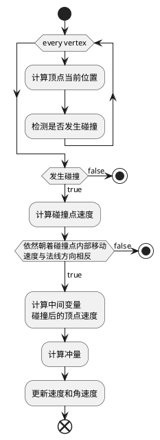
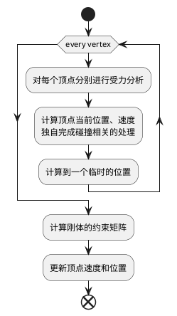

>   GAMES103 - 基于物理的计算机动画入门 [链接](https://www.bilibili.com/video/BV12Q4y1S73g)

> 某些特殊写法的记录：
> - $\rm M$ 经常在公式中可以看到的质量矩阵，可以理解成 $\begin{bmatrix}m&0&&0\\0&m&&0\\&&\cdots&0\\0&0&0&m\end{bmatrix}$ 这样的对角矩阵（这就一般就是3x3矩阵）

# 1. 刚体模拟
完全不会发生形变的物体，被称为**刚体**。

刚体的运动，以及随之而来的碰撞检测，此处主要提到了两个做法：

1. Impulse [维基百科](https://en.wikipedia.org/wiki/Impulse_(physics))
2. Shape Matching
## 1.1. Impulse
通过物理的方式，将物体视作一个整体。在于另一个物体进行碰撞时，基于选定的碰撞点进行受力分析，并根据计算得到的冲力 $\rm j$ 更新回物体的速度和角速度。

>  补充：
>  1.  计算顶点当前位置：$\rm x_\it{i}\leftarrow \rm x+\rm R\rm r_\it i$
>  2. 判断是否发生碰撞：$\phi(\rm x_i)<0$。这里是基于一种统一的边界值定义，在内部表示为 $\phi(\rm x)<0$；在外部表示为 $\phi(\rm x)>0$；在边界上表示为 $\phi(\rm x)=0$。
>  3. 计算碰撞点速度：$\rm v_i\leftarrow\rm v + \rm{\omega}\times\rm R\rm r_i$
>  4. 计算的碰撞后的顶点速度 $\rm v_i^{new}$： $$\begin{align*}\rm v_{N,i}&\leftarrow(\rm v_i\cdot N)N\\\rm v_{T,i}&\leftarrow\rm v_i-\rm v_{N,i}\\a&\leftarrow max(1-\mu_T(1+\mu_N)\frac{||\rm v_{N,i}||}{||\rm v_{T,i}||}, 0)\\\rm v_{N,i}^{new}&\leftarrow-\mu_N\rm v_{N,i}\\\rm v_{T,i}^{new}&\leftarrow a\rm v_{T,i}\\\rm v_i^{new}&\leftarrow\rm v_{N,i}^{new}+\rm v_{T,i}^{new}\end{align*}$$
>  5. 计算冲量 $\rm j$：$$\begin{align*}\rm K&\leftarrow\frac{1}{\rm M}-(Rr_i)^*I^{-1}(Rr_i)^*\\\rm j&\leftarrow\rm K^{-1}(\rm v_i^{new}-v_i)\end{align*}$$其中的 $(Rr_i)^*$ 是将叉乘转换为矩阵乘法之后的产物 $$\begin{align*}\rm v_i^{new}&=\rm v_i+\frac{1}{\rm M}\rm j-(Rr_i)\times(I^{-1}(Rr_i\times\rm j))\\&=\rm v_i+\frac{1}{\rm M}\rm j-(Rr_i)^*I^{-1}(Rr_i)^*\rm j\\&\text{提取}\rm j\text{的参数命名为}\rm K\end{align*}$$
>  6. 更新速度 $\rm v$ 和角速度 $\rm \omega$：$$\begin{align*}\rm v&\leftarrow\rm v+\frac{1}{\rm M}\rm j\\\rm\omega&\leftarrow\rm\omega+I^{-1}(Rr_i\times\rm j)\end{align*}$$
## 1.2. Shape Matching
不再基于物理的方式进行思考，使用一个简单的弹簧质点系统（只是类似，没看出有做过点与点之间的弹性计算），来进行分析。

在每次的运动模拟结束后，会通过约束的方式，消除其内部发生的形变。

> 补充：
> 1. 此处顶点的位置命名为 $\rm x$ 中间临时位置命名为 $\rm y$
> 2. 计算刚体约束矩阵。计算中间状态时，质点模型和原刚体模型之间，变化最小的矩阵（维持重心位置，得到一个刚体模型移动到中间位置后最合适的旋转角度）$$\begin{align*}\rm c&=\frac{1}{N}\sum_{i=0}^N\rm y_i\\[2ex]\rm A&=(\sum_{i=0}^N(\rm y_i-\rm c)\rm r_i^T)(\sum_{i=0}^N\rm r_i\rm r_j^T)^{-1}\\[2ex]\rm R&=PolarDecomposition(\rm A)\end{align*}$$`Polar Decomposition`可以将矩阵拆分，得到唯一的$\rm RS$。 分别表示 $\rm R$ 旋转和 $\rm S$ 形变。
> 3. 更新速度（这里必须提一下是最开始对每个质点进行分析的时候，就计算过一次速度和位置，但那个只是一个中间值，所以当时的速度 $\rm v_i$ 和最后这里的 $\rm v_i$ 并不是同一个）$$\begin{align*}\rm v_i&\leftarrow\frac{\rm c+\rm Rr_i-\rm x_i}{\Delta t}\\[2ex]\rm x_i&\leftarrow\rm c+\rm Rr_i\end{align*}$$

# 2. 弹簧质点系统
将物体解构为很多的带质量的点，并通过之间的弹性线段连接来模拟物体的一种方式。

弹簧质点系统的优势在于其可以很好的与模型本身的顶点信息建立联系，通过对顶点信息进行数据分析，可以直接建立所需的质点系统。

## 2.1. 理想弹簧模型
弹簧的弹力与其形变量成正比，公式为：
$$\begin{aligned}E(x)&=\frac{1}{2}k(x-L)^2\\f(x)&=-\frac{dE}{dx}=-k(x-L)\end{aligned}$$
在三维空间中表示，使用 $x_i$ 和 $x_j$ 分别表示弹簧的两个点。可以得到以下关系：
$$\begin{aligned}E(x)&=\frac{1}{2}k(||x_i-x_j|| -L)^2\\f_i(x)&=-\nabla_iE=-k(||x_i-x_j|| -L)\frac{x_i-x_j}{||x_i-x_j||}\\f_j(x)&=-\nabla_jE=-k(||x_j-x_i||-L)\frac{x_j-x_i}{||x_j-x_i||}\\f_i&=-f_j\end{aligned}$$
> 其中的 $\nabla E$ 表示的是其梯度的导数 $(\frac{\partial E}{\partial x})^T$

### 2.1.1. 构建弹簧质点系统
规则化布局和非规则化布局的顶点布局，分别来构建弹簧质点系统。

- 规则化布局 比较经典的例子是平铺的正方形布局。 通常会按照以下的方式来添加弹簧：
	1. 对角连线
	2. 直线上间隔一个顶点之间连线

## 2.2. 布料模拟
弹簧质点系统的一个经典应用场景。

# 附加内容

> 课后阅读记录

- Bridson et al. 2003. Simulation of Clothing with Folds and Wrinkles. SCA.