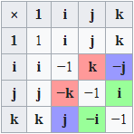
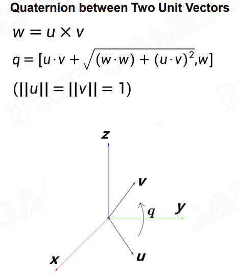

## 射线经过平面检测
首先，对表示平面的数据进行压缩，使用一个 `vec4` 来进行表示，其中：
- `xyz`<br>表示为平面的法线 $N_{plane}$
- `w`<br>表示为 $- N_{plane} \cdot P_{plane}$（使用平面法线点乘平面中的一点）

最后，可以使用下方的式子计算判断射线是否经过平面（将上方计算到的平面的值使用 $V_{plane}$ 来表示）：
$$
-\frac{V_{plane}\cdot {Ray}_{origin}}{V_{plane}.xyz \cdot {Ray}_{dir}} > 0
$$
如果计算到的结果大于0，表示射线经过平面；反之，不经过。

## Shading 和 Shadow
为了对图像的各个阶段进行区分，将认为 Shading 和 Shadow 是两个完全不同的阶段。
- Shading<br>着色阶段。根据像素本身，以及光的颜色，计算最终像素的颜色。
- Shadow<br>阴影。根据每个像素的可见性，计算阴影。

## 四元数

四元数的基础定义分为实部和虚部两个部分。
$$\rm q = \begin{bmatrix}a&b\rm{i}&c\rm{j}&d\rm{k}\end{bmatrix}$$

> 通常，也会使用 $\rm{q}=\begin{bmatrix}\rm{s}&\rm{v}\end{bmatrix}$ 来表示四元数。其中 $\rm{s}$ 表示实部，$\rm{v}$ 表示虚部。

在定义中，规定了虚部的四个虚数计算关系：
$$\begin{gathered}\rm i^2=j^2=k^2=ijk=-1\\[2ex]\implies\begin{cases}\rm ij=k\\\rm ik=j\\\rm jk=i\end{cases}\end{gathered}$$

> $$\begin{aligned}\rm ijk&=-1\\\rm(ijk)*k&=\rm-k\\\rm-ij&=\rm-k\\\rm ij&=\rm k\end{aligned}$$
> 后续同理<br>**这里需要特别注意：<u>顺序也会导致值不同，即 $\rm ij=k$，但 $\rm ji=-k$</u>**<br>其他的见下表：
> 

如果按照具体的含义进行分析，满足一下关系（其中 $\rm{q}$ 是单位四元数）：
$$\begin{cases}\rm{q}=\begin{bmatrix}cos\cfrac{\theta}{2}&\rm{v}\end{bmatrix}\\||\rm{v}||=\sin\cfrac{\theta}{2}\end{cases}$$

> 虚部主要表示旋转轴，与实部配合，可以表示绕轴旋转角度 $\theta$

四元数转换旋转矩阵：
$$\rm R=\begin{bmatrix}1-2c^2-2d^2&2bc-2ad&2ac+2bd\\2bc+2ad&1-2b^2-2d^2&2cd-2ab\\2bd-2ac&2ab+2cd&1-2b^2-2c^2\end{bmatrix}$$

### 四元数的应用
> 1. $$q^*=\begin{bmatrix}a\\-bi\\-cj\\-dk\end{bmatrix}$$
> 2. $$\begin{cases}q_1=a+bi+cj+dk\\q_2=e+fi+gj+hk\end{cases}\implies q_1q_2=\begin{bmatrix}a&-b&-c&-d\\b&a&-d&c\\c&d&a&-b\\d&-c&b&a\end{bmatrix}\begin{bmatrix}e\\f\\g\\h\end{bmatrix}$$

1. 四元数旋转$$v'=qvq^*=qvq^{-1}$$其中，$v$ 不是需要旋转的向量，如果原本的向量表示为 $\rm v$，则 $v=\begin{bmatrix}0&\rm v\end{bmatrix}$<br>[四元数旋转证明](https://krasjet.github.io/quaternion/quaternion.pdf) [[资源/Eric Lengyel - Mathematics for 3D Game Programming and Computer Graphics, Third Edition-Cengage (2011).pdf|PDF]] [Github](https://github.com/Krasjet/quaternion) P27 3.2.3 v的旋转
2. 四元数的逆$$q^{-1}=\cfrac{q^*}{||q||^2}$$
3. 四元数表示两个向量之间的旋转关系

## BRDF
> https://www.bilibili.com/video/BV1J3411n7WT 视频章节，基于物理的材质

一种基于物理的光照模型，定义的是光输入和输出的关系。具体的知识点可以查看[[现代计算机图形学入门#9 辐射度量学]]。

### GGX
BRDF的一种实现，将原本的光照函数进行了转化：
$$\begin{aligned}\rm \mathnormal{L}_o(x, \omega_o)&=\rm\int_{H^2}\boxed{\mathnormal{f_r}(x,\omega_o,\omega_i)}\mathnormal{L_i}(x,\omega_i)cos\theta_i\mathnormal{d\omega_i}\\f_r&=k_d\boxed{f_{Lambert}}+\boxed{f_{CookTorrance}}\\\implies&\begin{cases}f_{Lambert}=\cfrac{c}{\pi}&\text{diffuse}\\f_{CookTorrance}=\cfrac{DFG}{4(\omega_o\cdot n)(\omega_i\cdot n)}&\text{spectual}\end{cases}\\\implies \rm\mathnormal{L_o}(x,\omega_o)&=\int_{H^2}\left(k_d\cfrac{c}{\pi}+\cfrac{DFG}{4(\omega_o\cdot n)(\omega_i\cdot n)}\right)L_i(x,\omega_i)(\omega_i\cdot n)d\omega_i\end{aligned}$$

其中定义了 $\rm DFG$，分别表示的含义如下所示：
#### D-Normal Distribution Function
法线分布方程，用于描述表面的粗糙程度。
$$\operatorname{NDF}_{GGX}
(n,h,\alpha)=\cfrac{\alpha^2}{\pi\left((n\cdot h)^2(\alpha^2-1)+1\right)^2}$$

```cpp
// Normal  Distribute Function using GGX Distribution
float D_GGX(float NoH, float roughness)
{
	float a2 = roughness * roughness;
	float f = (NoH * NoH) * (a2 - 1.0) + 1.0;
	return a2 / (PI * f * f);
}
```

#### G-Geometric attenuation term(self-shadowning)
自遮挡，表现的是，光照方向与平面夹角越小时，自遮挡越强；相对的角度越大（垂直时最大），自遮挡越弱
$$\begin{aligned}G_{Smith}(l,v)&=G_{GGX}(l)\cdot G_{GGX}(v)\\G_{GGX}(v)&=\cfrac{n\cdot v}{(n\cdot v)(1-k)+k}\\&\implies k=\cfrac{(\alpha+1)^2}{8}\end{aligned}$$

```cpp
// Geometry Term: Geometry masking/shadowing duo to microfacets
float GGX(float NoV, float k)
{
	return NoV / (NoV * (1.0 - k) + k);
}

float G_Smith(float NoV, float NoL, float roughness)
{
	float k = pow(roughness + 1.0, 2.0) / 8.0;
	return GGX(NoL, k) * GGX(NoV, k);
}
```
#### F-Fresnel Equation
菲尼尔方程，当视线与平面的夹角越小，光线进行反射的比例越高；反之，光线进行折射的比例越高。

$$F_{Schlick(h,v,F_o)}=F_o+(1-F_o)(1-(v\cdot h))^5$$

```cpp
//Fresnel term with scalar optimization
float F_Schlick(float VoN, float f0)
{
	float f = pow(1.0 - VoN, 5.0);
	return f0 + (1.0 - f0) * f;
}
```