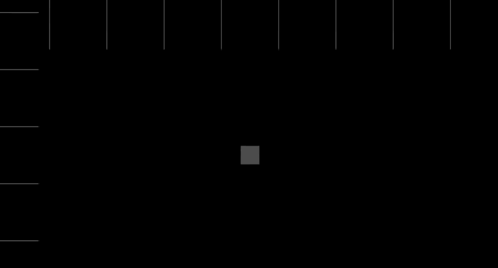
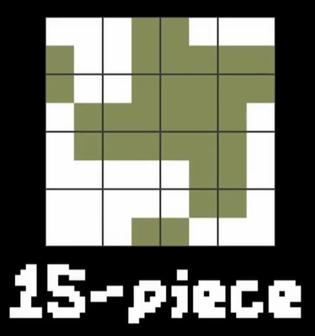
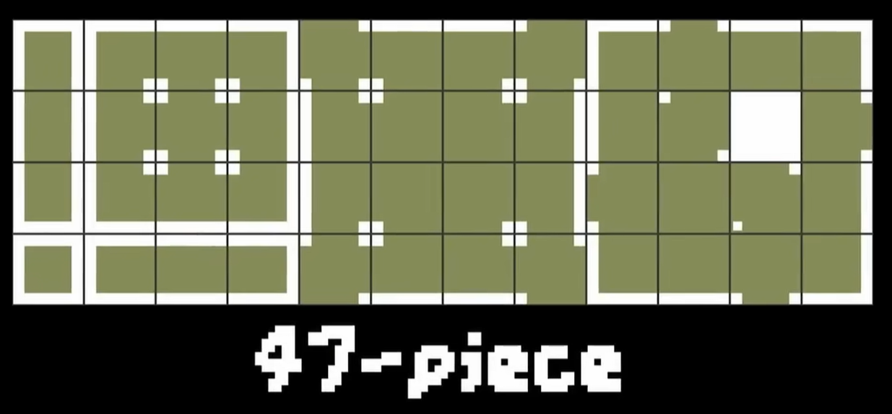

为了使得瓦片间的过度更加自然，这通常意味着需要更多的美术资源，用来分别处理不同相邻瓦片状态下的贴图。对于标准的矩形网格而言，想对周围的8个网格的所有状态分别产出不同的贴图，需要总计256种不同的贴图。

这个数量非常庞大，而且实际使用中通常并不需要这样多的组合。（主要是市面上大部分2D游戏的过度仅需要考虑正四个方向的连接，而对角连接的情况关注并不多，后续的方法优化主要也是针对仅考虑正四个方向连接的情况）

为了减少资源的数量，就需要优化规则。

# 1.三种常见的瓦片集

业内经常使用的瓦片资产生成规则，可以在使用尽可能少资源的情况下，满足绝大多数需要。

## 15-piece

15片瓦片集合，将正常的8个方向连接，简化为四向连接，因此简化掉了大量的组合方式，只需要非常少的资源就能完成。

但也存在一些严重的问题：
- **瓦片的图案中心与网格有偏移** 因为是将之前的3x3简化为了2x2，图案的中心实际也是对瓦片中心偏移了0.5。这使得比较难决定每个单元格内的瓦片具体想表示的哪种瓦片。 举一个具体的例子，比如想表示一列瓦片，在15片瓦片集合下，实际需要绘制两列，才能拼接成想要的形状。
- **能表示的组合并不多** 也是因为从3x3简化为了2x2，导致对角和正方向的信息被放在了一起，无法拆开分别处理。

## 47-piece

47片瓦片集合。使用最多的一种标准，并没有对每个瓦片表示3x3这条关键的规范进行简化，使得它其实并没有丢失太多信息（主要是缺了对角的变体）。相对的，其要求的资源量依然很多。

## 16-subset

在47片瓦片集合的基础上，对大部分游戏（瓦片要求不算很精细），可以只取其中的一部分，最终提取出对表现影响最明显的16个子集。

# Dual-grid system

双网格系统，在15片瓦片集合的基础上进行的优化，由于有提到它最大的问题就是瓦片中心与实际希望表示的中心有偏移0.5，导致表示的效果让人困惑。

为了解决这个问题，可以采用两个Grid来配合，分类数据层和表现层。
 - 作为数据层的Grid用来存储实际是哪些索引上有瓦片数据。
 - 作为表现层的Grid与数据层Grid偏移0.5，来补偿这里提到的偏移问题，根据数据层的周围四格瓦片数据，判断展示的贴图。

