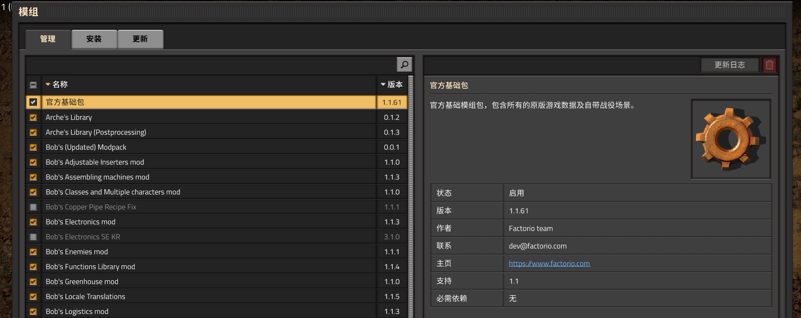

探索mod在游戏中的管理方法

# 1. 以Mod作为卖点的游戏
## 1.1. Minecraft
> Minecraft最初使用 Java 语言进行编写，使得其支持代码具备 Java 的特性，比如反射。这里大致观察的是 MinecraftForge 库，内部使用了大量的反射，对核心逻辑进行拓展，并对其他开发者暴露接口，实现自定的逻辑。当然，如果有必要，也可以直接通过 Java 的类加载器 `ClassLoader` 来反射不同的类，修改类方法。
> 
> 但是这种方式也会有明显的局限性，甚至可以说官方本身（早期版本）在这其中并没有起到积极作用。

Minecraft 基岩版，是微软收购游戏后，使用 C++ 实现的全新版本，基本上可以理解为两个游戏，但是官方对于游戏的模组开发相当看中，甚至最初的设计也是为了能够让用户更好得实现自己的模组。

最终，官方选择的是一种基于数据的框架（类ECS，具体游戏内部的框架也没说），游戏的逻辑对外部隐藏，而用户通过修改外部的游戏数据文件来实现不同的效果。在他们的框架中，同样有 ”组件“ 这样的概念，会有类似模型组件来决定具体渲染的模型样式，材质组件来决定物体渲染的效果等等。模组开发者通过查阅官方开发文档，编写 json 文件，就可以实现各式各样的效果。

### 1.1.1. 官方示例 - 替换泥土材质
一个简单的示例 https://docs.microsoft.com/en-us/minecraft/creator/documents/resourcepack：
```json
{
	"format_version": 2,  //不是很懂这里是不是写错了，在中文维基中查到这个应该是适配的游戏版本号
	"header": {
		"description": "My dirt resource pack Add-On!",
		"name": "My Resource Pack",
		"uuid":"f792a765-6eec-47e1-baea-599424fec93d",
		"version": [1, 0, 0],
		"min_engine_version": [1, 16, 0]
	},
	"modules": [
		{
			"description": "My First Add-On!",
			"type": "resources",
			"uuid": "457f55a3-2573-4e3c-a5db-f7e64b3d43a5",
			"version": [1, 0, 0]
		}
	]
}
```

目录结构：


这里 json 文件中并没有实现什么特殊的逻辑，最终的替换泥土材质，原理是模组结构与原生扩展包（Add-on）文件对应，同名资源替换，来实现的修改泥土材质。

> 事实上，在 json 文件中，也可以处理一些简单的逻辑（字符串）：
> ```json
> ...
> "minecraft:experience_reward": { 
> 	"on_bred": "Math.Random(1,7)", 
> 	"on_death": "query.last_hit_by_player ? Math.Random(1,3) : 0"
> },
> ...
> ```

而对于一些配置文件很难实现的独特逻辑，官方也提供了脚本接口来扩展用户逻辑。

> 网上都说有一套js脚本，但是我查到现在官方文档上都写的是 Python
> https://docs.microsoft.com/zh-cn/minecraft/creator/documents/introductiontoaddentity

脚本主要采用的是注册系统，处理回调的方式。
大概就是下面这种感觉：

```python
# 这里绑定Mod的名字，和这个包的 manifest.json 中对应
# 使得这里变成了整个脚本的入口
@Mod.Binding(name="HelloWorldMod", version="0.0.1")
class HelloWorldMod(object):
	...
	# 在服务器启动的时候会调用这个接口
	@Mod.InitServer()
	def HelloWorldServerInit(self):
		# 注册系统类
		serverApi.RegisterSystem("HelloWorldMod", "HelloWorldServerSystem", "helloWorldMod.helloWorldServerSystem.HelloWorldServerSystem")

# ========== helloWorldServerSystem.py ==============
class HelloWorldServerSystem(ServerSystem):

	# 设置事件监听
	def __init__(self, namespace, system_name):
		super(HelloWorldServerSystem, self).__init__(namespace, system_name)
		self.ListenForEvent(serverApi.GetEngineNamespace(), serverApi.GetEngineSystemName(), "ServerChatEvent", self, self.OnServerChat)

	# 注册的服务器用户输入回调
	def OnServerChat(self, args):
		...  # 具体逻辑
```

### 1.1.2. 更新完善

官方为了让暴露出的组件更加易于开发者拓展，它们将游戏大量的基础的逻辑配置都抽离出来，变为了一个包（基本可以将原生的游戏内容也理解为是一个模组）。用户的模组将会按照顺序加载，并最终覆盖原生的游戏内容，实现修改扩展原始游戏的效果。

> 因为我没有买基岩版的 MC 所以这里贴的是使用了相同策略的游戏 Factorio（异星工场）
> 
> 游戏的基础内容会也可以被视作是一个模组

这种方式可以在一定程度上，保证接口暴露出的逻辑易于拓展，甚至游戏迭代本身，也是有利于模组功能拓展的。

### 1.1.3. 总结
Minecraft 采用的是一种配置文件以及回调脚本共同作用的模组实现机制，可以将原生的游戏内容也抽成一个独立的模组，这可以让模组开发者在游戏支持的框架内，尽可能的扩展游戏的玩法。

代价就是，相比起 Java 版，具体的对象、逻辑都对模组开发者隐藏了（虽然 Java 版最开始也并不想对用户开放），导致一些更加特殊的效果难以实现，同时也会难以进行优化。当然，一定程度上，好的文档可以缓解这方面的问题，但是毕竟是为了保持黑盒做出的必要牺牲，也无法完全避免。

### 1.1.4. 相关游戏

目前已知用到这种处理方法的游戏：
- Factorio 异星工厂<br>
- RimWorld 环世界<br>

## 1.2. 上古卷轴5-天际

# 参考资料
- Minecraft：每位玩家都可以是开发者！全新工具、官方文档，助力每一位玩家的创造之旅！【基岩说#MC Live特别篇】<br>https://www.bilibili.com/video/BV1jQ4y1z7FB
- Minecraft基岩版开发Wiki<br>https://wiki.bedev.cn/page/Minecraft%E5%9F%BA%E5%B2%A9%E7%89%88%E5%BC%80%E5%8F%91Wiki
- MinecraftForge Github<br>https://github1s.com/MinecraftForge/MinecraftForge/tree/1.12.x
- Minecraft 1.3.2-1.15.2 原版 / FML CoreMod 开发教程 Github<br>https://github.com/xfl03/CoreModTutor
- 网易示例（国际版和中国版细节上会有区别，但是教程比较详细，微软惜字如金）<br>https://mc.163.com/dev/mcmanual/mc-dev/mcguide/20-%E7%8E%A9%E6%B3%95%E5%BC%80%E5%8F%91/13-%E6%A8%A1%E7%BB%84SDK%E7%BC%96%E7%A8%8B/60-Demo%E7%A4%BA%E4%BE%8B.html?catalog=1