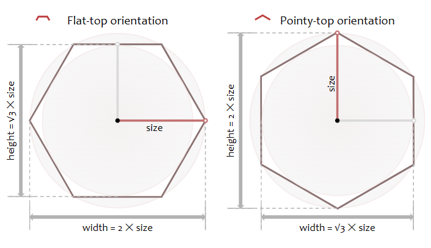
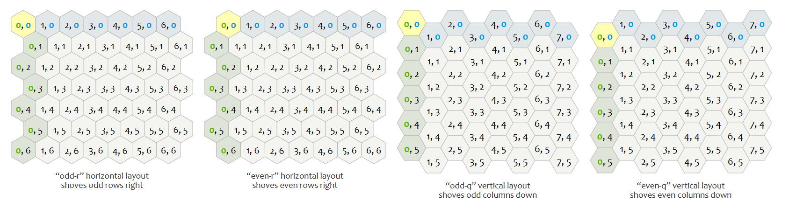
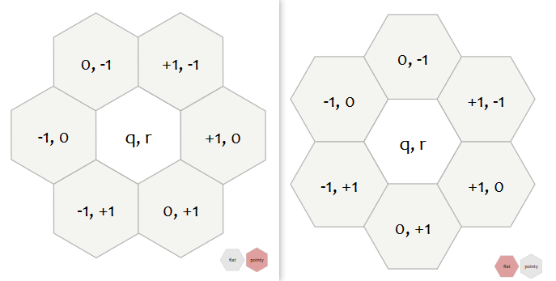
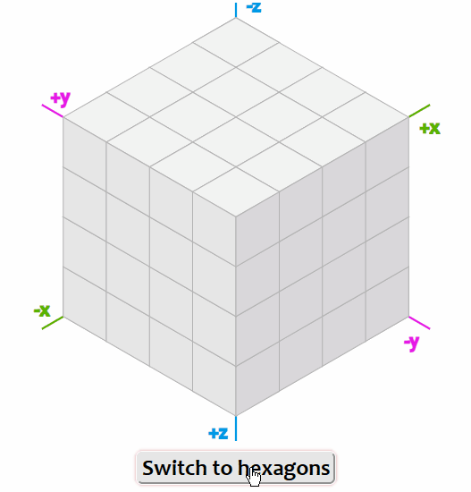
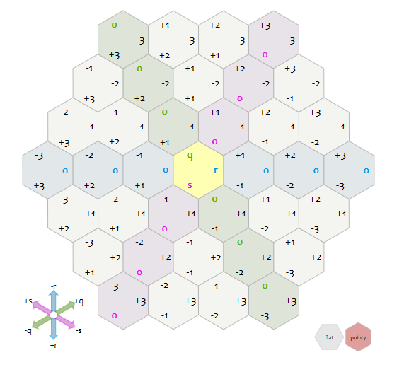
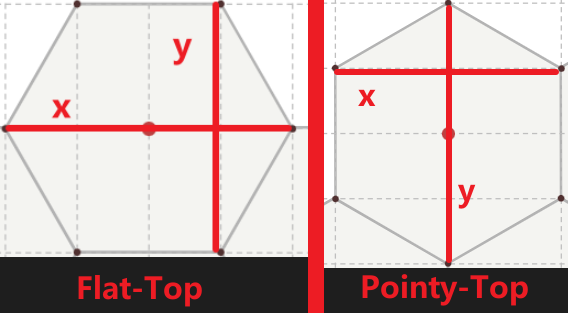

> 参考 https://www.redblobgames.com/grids/hexagons

# 六边形网格

六边形网格细分，可以被区分为两种不同的布局：
- 平顶六边形（Flat-top）
- 尖顶六边形（Pointy-top）



两种不同的基础形状将会导致后续一系列的区别，主要体现在转换矩阵不同

> 可以把平顶理解为尖顶逆时针旋转30°后的效果

## 1.坐标轴系统

### 1.1.使用六边形网格构建的坐标轴



> 实际根据后续的转换公式就可以得知
> - 尖顶六边形网格（索引）坐标系应该是由，X轴以及与X轴60°（或者120°）夹角的Y轴构成
> - 平顶六边形网格（索引）坐标系应该是由，Y轴以及与Y轴60°（或者120°）夹角的X轴构成
> 
> 因此最后计算的时候，实际上都会进行转换，这里以尖顶为例：实际最后会进行类似 $col=x \pm floor(y * 0.5)$ 的处理，才能转换到上图这样的效果<br>实际每个位置上的加减是如下图的，索引也是呈六边形一圈一圈向外扩散的
> 
> 

### 1.2.立方体坐标系

在我的理解中，本质上是为了方便理解六边形网格所提出一种坐标系，其存在的目的是为了解决二维坐标无法（或者说不容易实现）按照六边形网格的取整的问题。

它不像是常规的直角坐标系，使用两个相互垂直的X、Y作为，坐标轴，而是选择了三条夹角为60°的直线作为坐标轴（也可以直接理解为特定角度下的三维笛卡尔坐标系）。



在文章中，将其理解为这是过正立方体对角线的表示方式，因此，这里每个顶点（也就是每个六边形的中心）都应该满足等式 $x+y+z=0$。这也会成为后续计算取整的重要依据。



> 这里还能看出一个比较重要的特点，之前的 $x$、$y$ 带入这里的 $q$、$r$ 效果完全等价，唯一的区别只有一个 $s$，它存在的原因也是用来维持 $q+r+s=0$ 这个等式。

## 2.常用计算

### 2.1.坐标转换

通过二维坐标计算对应的六边形索引

> 这里补充六边形网格的大小控制，这里主要参考了 Unity 中的规则。
> 
> 通过Grid的 cell size 来控制每个单元格的大小，六边形网格和矩形网格最后都是通过两个参数xy来控制单元格大小。
> 
> 这里对六边形来说:
>
> 
> 
> 表现到最后的计算中，就需要先对二维坐标进行缩放，使其变回正六边形，然后再计算索引。

$$
\begin{aligned}&
\text{pointy top}
\begin{cases}\begin{bmatrix}x\\y\end{bmatrix} = \begin{bmatrix}\sqrt{3}&\sqrt(3)/2\\0&3/2\end{bmatrix} M_{size} \begin{bmatrix}q\\r\end{bmatrix}\\\begin{bmatrix}q\\r\end{bmatrix}=M_{size}^{-1}\begin{bmatrix}\sqrt(3)/3&-1/3\\0&2/3\end{bmatrix}\begin{bmatrix}x\\y\end{bmatrix}\end{cases}
\\&\text{flat top}
\begin{cases}\begin{bmatrix}x\\y\end{bmatrix} = \begin{bmatrix}3/2&0\\\sqrt{3}/2&\sqrt{3}\end{bmatrix} M_{size} \begin{bmatrix}q\\r\end{bmatrix}\\\begin{bmatrix}q\\r\end{bmatrix}=M_{size}^{-1}\begin{bmatrix}2/3&0\\-1/3&\sqrt{3}/3\end{bmatrix}\begin{bmatrix}x\\y\end{bmatrix}\end{cases}
\end{aligned}
$$

以上就是二维坐标与六边形网格的转换公式，其中还存在的一个问题，就是需要对结果进行取整，计算出的 $q$、$r$ 不一定是一个整数，同时，这里的索引是不能直接使用 `round` 进行四舍五入的，不然会在边缘处表现错误。

这里又引入了另一个取整公式：Cube round

先把六边形索引转换到CubeCoordinate，这里只需要根据三轴相加等于0，得到 $s=-q-r$。之后对三个轴分别求 `round`，这一步可能会导致最后 $q+r+s\ne 0$。为了避免这个问题，这里选择了误差最大的一个轴，调整为剩余两轴负值之和。

```python
# 计算对应的CubeCoordinate坐标
s = -q - r
cube_pos = np.array((q, r, s))

# 分别对三个轴计算round
round_cube_pos = round_q, round_r, round_s = round(cube_pos)
# 为了保证最后依然满足 q + r + s = 0，这里选择计算round前后误差最大的轴，使其变为剩余两轴的负值之和
delta_vec = np.abs(round_cube_pos - cube_pos)
# 如果q的差值最大
if delta_vec[0] > delta_vec[1] and delta_vec[0] > delta_vec[2]:
    round_q = -round_r - round_s
# 如果r的差值最大
elif delta_vec[1] > delta_vec[2]:
    round_r = -round_q - round_s
# 如果s的差值最大，如果只需要索引的话，这个分支可以不要
else:
    round_s = -round_q - round_r

# 返回最后的索引
return round_q, round_r
```

## 3.效果示意

TODO 放生成的mp4
