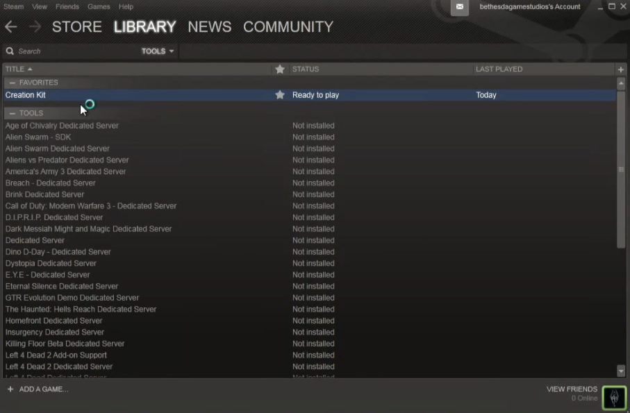

游戏的模组设计，主要探索的是作为游戏开发者，到底使用什么样的方法，能够不断吸引玩家/模组开发者来对游戏进行拓展。这里将选取两个在模组变化史上也意义非凡的游戏，来试图找到问题的答案。

# 1. 概述
> 摘自维基百科 https://zh.wikipedia.org/wiki/%E9%81%8A%E6%88%B2%E6%A8%A1%E7%B5%84
> > 英文中的“MOD”、“Mod”（全称“Modification”），意思是“修改”，中文翻译“游戏模组”。MOD通常对应可以修改的电子游戏，因此以电脑游戏为主。必须依赖与原作品方可执行游玩。游戏中的道具、武器、角色、敌人、事物、模式、故事情节等任意部分都可能属于修改范畴，多见于著名电子游戏作品，游戏类型多数为第一人称射击游戏、即时战略游戏、角色扮演游戏（非日式）、动作游戏，著名实例包括红色警戒2、毁灭战士系列、横扫千军、雷神之锤系列、半条命系列、Minecraft、虚幻系列、无冬之夜系列、地牢围攻系列、上古卷轴5和侠盗猎车手系列等。 

## 1.1. 模组形式
 - 官方工具<br>主MOD的游戏开发者会提供SDK或其他工具（如地图编辑器），允许并鼓励玩家自行创造，包括游戏中的模型。<br>从雷神之锤开始，经常有着名游戏的MOD以完全不同于原作形式出现，SDK通常足以大规模修改，有些开发者贩卖游戏引擎（甚至源代码）更加扩展。<br>地图编辑器则是较为简便的形式，通常由游戏开发者制作，星际争霸系列、无冬之夜系列和魔兽争霸III是这方面著名的例子。
 
  - 简单修改<br>有些游戏配置文件公开利于修改，例如侠盗猎车手III之后的GTA系列游戏。配置文件包括例如驾驶时的车辆操控、车辆颜色、武器属性、天气属性、NPC属性等，都是以纯文本存放的，并保留开发者的参数注释。车辆的模型和贴图，人物的模型和贴图，地图的模型和贴图等都是打包在一个IMG或RPF文件内，且打包文件的格式和模型文件和贴图文件的格式通常在游戏发售后不到半年就被破解，并由玩家制作出各式各样的模组。<br>有些则为暴力破解，如命令与征服系列。

 - 彻底修改<br>彻底修改是指根据现有游戏制作的一个模组，将几乎取代原始游戏中的所有艺术资产，有时甚至是游戏玩法的核心方面，比如《反恐精英系列》最开始就是脱胎于《半条命》一个大修模组，改变了游戏原始玩法。

 - 非官方补丁<br>非官方补丁可以是现有游戏的模组，但用于修复官方补丁未修复的错误，或者解锁已发布游戏文件中存在但在官方游戏中无法访问的内容。当原始开发者不愿意或无法正式提供功能时，此类补丁通常由游戏粉丝群成员创建，但缺点是开发商因为失误而未被删除的内容可能会被披露，如《侠盗猎车手:圣安地列斯》中的“热咖啡”。

- 附加组件<br>附加组件是一种典型的小型模组，可添加到特定游戏的原始内容中。在大多数情况下，附加组件会为游戏添加一个特定元素，例如射击游戏中的新武器、策略游戏中的新单位或地图、赛车游戏中的新车辆或赛道、Minecraft或Terraria等游戏中的新道具，或模拟游戏中的附加内容（例如新的可驾驶飞机，新的火车等）。这可以在不改变任何原始游戏现有内容的情况下完成。

## 1.2. 补充一点前面的话

由于模组本身其实是更加偏向Gameplay的模块，想不到有什么东西会需要引擎层面来支持，因此这篇文档更多的也不会去关注其中的实现方式<span style="background-color:black;color:black">（现在应该还没有一套完美方案，适合各种类型的游戏，在某个方面表现比较好就会在其他方便付出代价）</span>，将会从更上层的角度出发，关注的是游戏设计者如何设计规则让模组开发者进行开发。

因此，这篇文档可能会提到部分游戏的<s>不完整</s>模组开发流程（用于说明设计者预期内的模组开发流程），但无法作为一篇真正的模组开发教程。

> 类似通过hook的方式来扩展游戏内容并不在本文的探讨范围内，因为一般也认为这其实算不上是游戏设计者最初设想中的模组开发方式。

# 2. 代表游戏
## 2.1. 上古卷轴5-天际
> 官方管理的 mod 站：https://bethesda.net/zh-CN/mods/skyrim

上古卷轴5作为一款11年的ARPG游戏，在B社的设计之初，就希望其能够利于第三方的游戏模组开发，因此最开始就为模组开发提供了支持包括官方的模组开发工具以及大量的文档。这也使得上古卷轴5在无数模组开发者的努力下，能够一直坚挺至今。

### 2.1.1. 官方工具
> 官方文档 https://www.creationkit.com/index.php?title=Main_Page
> 
> 官方教程视频 https://www.youtube.com/watch?v=gDKivlGmia4



如果购买了Steam上的上古卷轴5游戏，会附赠官方的开发工具（听说可以通过B社官方平台下载，然而实际找了没找到）


1. 对象管理窗口<br>在加载资源文件（esm文件）之后，会根据左侧选择的类型，罗列属于该类型的对象。
2. 3D渲染窗口<br>主要用于配合下面的CellView，来制作3D场景。包含了编辑交互功能。
3. 房间视图窗口<br>显示了指定世界（World）中的所有房间（Cell）；在选中，加载了某个房间之后，右侧的列表中会现实房间中的所有元素。

---
不同类型的资源提供了具体的编辑界面，这部分会和常规的引擎编辑器有较明显的差异。

例如角色编辑界面，与游戏的逻辑耦合，其中额外包括了设置角色的阵营、装备、行为（主要以选项出现，但是也提供了定制AI组件的接口）等，和游戏内容关系很密切的特殊参数配置。


### 2.1.2. 总结
官方设计的方案，是围绕提供的开发工具，来实现模组开发。这样的开发工具相比其他的游戏引擎编辑器，最大的特点是其中会自然表现出各种逻辑间的耦合性，以此来降低模组开发（或者学习理解的难度）。

> 魔兽争霸3 地图编辑器 <span style="background-color:black;color:black">按理说确实不该说这里的爹像儿子，但是确实差不多的东西，所以还是放在这儿了</span><br>

## 2.2. Minecraft
> Minecraft最初使用 Java 语言进行编写，使得其支持代码具备 Java 的特性，比如反射。这里大致观察的是 MinecraftForge 库，内部使用了大量的反射，对核心逻辑进行拓展，并对其他开发者暴露接口，实现自定的逻辑。当然，如果有必要，也可以直接通过 Java 的类加载器 `ClassLoader` 来获取类对象，反射修改类方法。
> 
> 但是这种方式也会有明显的局限性，甚至可以说官方本身（早期版本）在这其中并没有起到积极作用。

Minecraft 基岩版，是微软收购游戏后，使用 C++ 实现的版本。在游戏的最初版本，官方就已经为模组相关的设计给到了极高的比重。

> 在每年9月底到10月初的 Minecarft Live（之前叫Minecarft Earth）上，官方也会着重提到开发社区的优化内容。
> - Minecarft Live 2021 中介绍了一个主要用于MC相关模型开发的工具 Blockbench（Github开源，支持网页版，支持各个版本的MC资源制作，也可以制作通用的obj资源）<br>
> - Minecarft Live 2018 Modded Minecraft: Playing with Power<br>邀请了几位模组开发者讨论他们严重的模组，如何实现，对模组开发初学者的基础知识科普。其中谈到了Minecraft的<span style="background-color:black;color:black">好的</span>模组的历史。

### 2.2.1. 官方设计的模组开发方式

在官方的设计中，基岩版引入了附加包（Add-on）这种方式，来自定义修改或添加游戏的内容。

这里的附加包，为了适应Client-Server架构，能够对两侧有不同的处理，将其分为了两个部分：

- 行为包（behavior_pack）<br><b>服务器</b>。用于服务器进行全局统一的计算，包括AI、地图生成等。
- 资源包（resource_pack）<br><b>客户端</b>。用于具体的呈现，将来自服务器的地图、生物模型等数据，绘制到屏幕上。

与之相对的，为了方便开发者对原版内容进行修改，将原本的内容也基于同样的方式来实现，并将其命名为原版包（Vanilla Packs），用户附加包的冲突资源将会直接覆盖掉原版包中的内容，从而实现对原版内容的修改。


> 上面的 My Resource Pack 就是添加的附加包，而这里的全局，就是原版包

---

> 此处的分类参考【Minecraft：官方竟用模组实现原版内容？基岩版数据驱动到底是什么意思？【基岩说】】 https://www.bilibili.com/video/BV1FP4y1a72c

此外，根据附加包中修改的内容不同，也会被分为三类接口：

1. 数据驱动接口<br>最重要的开发接口，游戏运行时通过读取解析配置文件，再向游戏中添加对应的内容，官方将这个过程称为数据驱动。而预设的json文件关键字，就是官方的数据驱动接口。
2. 脚本引擎接口<br>通过Python脚本，注册特定状态的回调处理。
3. GameTest框架接口<br>测试接口。

### 2.2.2. 官方示例：替换泥土材质
一个简单的示例 https://docs.microsoft.com/en-us/minecraft/creator/documents/resourcepack

```json
{
	"format_version": 2,  //网易的教程写的是游戏版本(字符串)，试了一下应该都可以
	"header": {
		"description": "My dirt resource pack Add-On!",
		"name": "My Resource Pack",
		"uuid":"f792a765-6eec-47e1-baea-599424fec93d",
		"version": [1, 0, 0],
		"min_engine_version": [1, 16, 0]
	},
	"modules": [
		{
			"description": "My First Add-On!",
			"type": "resources",
			"uuid": "457f55a3-2573-4e3c-a5db-f7e64b3d43a5",
			"version": [1, 0, 0]
		}
	]
}
```

目录结构：


这里 json 文件中并没有实现什么特殊的逻辑，最终的替换泥土材质，原理是模组结构与原生扩展包（Add-on）文件对应，同名资源替换，来实现的修改泥土材质。


> 事实上，在 json 文件中，也可以处理一些简单的逻辑（字符串）：
> ```json
> ...
> "minecraft:experience_reward": { 
> 	"on_bred": "Math.Random(1,7)", 
> 	"on_death": "query.last_hit_by_player ? Math.Random(1,3) : 0"
> },
> ...
> ```

> **补充s：**<br>
> 而对于一些配置文件很难实现的独特逻辑，官方也提供了脚本接口来扩展用户逻辑。
>
>> 网上都说有一套js脚本，但是我查到现在官方文档上都写的是 Python
>> https://docs.microsoft.com/zh-cn/minecraft/creator/documents/introductiontoaddentity

### 2.2.3. 示例：脚本注册用户输入回调

脚本主要采用的是注册系统，处理回调的方式。
大概就是下面这种感觉：

```python
# 这里绑定Mod的名字，和这个包的 manifest.json 中对应
# 使得这里变成了整个脚本的入口
@Mod.Binding(name="HelloWorldMod", version="0.0.1")
class HelloWorldMod(object):
	...
	# 在服务器启动的时候会调用这个接口
	@Mod.InitServer()
	def HelloWorldServerInit(self):
		# 注册系统类
		serverApi.RegisterSystem("HelloWorldMod", "HelloWorldServerSystem", "helloWorldMod.helloWorldServerSystem.HelloWorldServerSystem")

# ========== helloWorldServerSystem.py ==============
class HelloWorldServerSystem(ServerSystem):

	# 设置事件监听
	def __init__(self, namespace, system_name):
		super(HelloWorldServerSystem, self).__init__(namespace, system_name)
		self.ListenForEvent(serverApi.GetEngineNamespace(), serverApi.GetEngineSystemName(), "ServerChatEvent", self, self.OnServerChat)

	# 注册的服务器用户输入回调
	def OnServerChat(self, args):
		...  # 具体逻辑
```

### 2.2.4. 总结
和上古卷轴5的模组设计对比，Minecraft采用了一种完全不同的方案，并且这套方案也吸引了其他游戏制作者，并使得他们采用类似的方案，用于各自游戏的模组设计实现。

> - Factorio 异星工厂<br>开发者之一Kovarex承认游戏有从Minecraft的外挂模组中获得开发灵感。https://web.archive.org/web/20210202140711/https://www.reddit.com/r/nerdcubed/comments/2c9rh7/nerd%C2%B3_fw_factorio/cjdtffh/<br>
> - RimWorld 环世界<br>虽然没有明确说明，但是这个游戏的设计也能明显感受到Minecraft的影子，甚至游戏本体包也是完全开放，可以直接看到确实是采用了和附加包同样的结构实现。<br>

但实际上这并不能完全说明两种设计孰优孰劣，从使用这两种策略的游戏类型也可以看出，类似上古卷轴这种RPG性质，每个角色的功能行为很好预测，那么官方工具逻辑耦合的问题其实根本算不上是问题，甚至可以说是有利于模组的开发；相对的，Minecraft 这种开放沙盒游戏，自由度更高，那么开发出的模组中，各种类型的数据行为就完全无法预测，此时让数据和逻辑之间尽可能得解耦也会更有利于后续的更新迭代。

# 3. 模组相关的知识

## 3.1. 创意工坊

是Steamworks的其中一项服务，为游戏提供了后端资源存储。

想要开启也很简单：

> 管理 Steam 创意工坊可见度
>
> Steam 创意工坊是由 Steam 管理的网站，列出所有分享的内容，允许用户对社区中可见内容进行投票或留言。 应用程序在创意工坊中默认为不对公众开放可见， 以此防止不打算通过 Steam 创意工坊门户共享的内容被公开，除非将创意工坊设定为公开。<br>创意工坊可见状态的设置步骤如下：
> 1. 打开 Steamworks 网站上的应用程序登录页面。
> 2. 点击“编辑 Steamworks 设置”
> 3. 在“创意工坊”选项卡中，选择“通用”
> 4. 在页面右边，找到“可见状态”栏。
> 5. 使用单选按钮选择可见度，可以为仅开发者可见、开发者和测试人员可见、顾客和开发者可见，以及所有人可见。
> 6. 在“发布”选项卡中选择“准备发行”
> 7. 点击“发布到 Steam”即可完成流程并发布变更。
> 
> 注意：如果要将可见度更改为所有人可见，必须完成创意工坊清单上的项目，包括品牌、标题、描述等，并至少有一项内容公开可见。

---


- `appid` 对应的游戏ID编号
- `contentfolder` 上传的内容，会将指定文件夹下的文件全部上传，即后续订阅的内容
- `previewfile` 预览图文件
- `publishedfileid` 提交的创意工坊内容ID（一般留空让Steam去分配）

## 3.2. 模组发展史

> 参考 https://www.nvidia.com/en-us/geforce/news/history-of-pc-game-mods/

- <s>淘金者 Lode Runner（FC） 1983年；坦克大战 Battle City（FC）1985年<br>早些年的游戏，由于卡带存储限制，设计关卡有限的情况下，通过内置地图编辑器的方式，变相延长了游戏寿命</s>
- Castle Wolfenstein 1981年
	> 一款古早的动作冒险游戏，玩家将扮演一名盟军战俘，从关押的沃尔芬斯坦城堡中逃脱，并且粉碎纳粹的秘密战争计划。
	
	出现了一款非常有人气的模组——“Castle Wolfenstein”。本身是一个将所有的纳粹士兵、怪物包括武器替换为了蓝精灵（风格）<br>
	<br>
- 毁灭战士 DOOM 1993年

	> 被认为是世界上最早的FPS游戏<span style="background-color:black;color:black">之一</span>，玩家将在游戏中扮演以为顽强的人类士兵使用各种武器与火星传送门中出现的恶魔大军战斗。<br><span style="background-color:black;color:black">这里说之一，是因为1982年还有更早的FPS游戏，德军总部3D，所以只能算最早一批</span>

	这款游戏的先锋性地位被广泛认同，它使用了包围游戏的3D环境绘图、提供了多人游戏支持，并且加入了让玩家自由创建拓展游戏内容的WAD（Where's All the Data）架构，都是游戏史上极具革命性的创新，也启发了后世的第一人称设计游戏。<br>
- 半条命/半衰期 Half-life 1998年

	> 在这个时期来说非常具有开创性的游戏，自该游戏之后，游戏行业也开始逐渐重视起了FPS的游戏剧情刻画。游戏的整体过程也伴随着有趣的解密等要素（这些要素也一直影响到了后续的游戏制作）

	脱胎自该游戏的游戏有《反恐精英》、《军团要塞》、《Garry's Mod》，这都得益于游戏的开发商Valve Software，他们模糊了玩家和开发商之间的界限，工作室也会定期从社区中雇佣<span style="background-color:black;color:black">收编</span>模组开发者以及关卡设计师加入。
- 魔兽争霸3 2002年<br>暴雪同时期又一集大成之作，作为RTS游戏，与之前的《星际争霸》(1998)、<span style="background-color:black;color:black">《红警》</span>等一样，也提供了地图编辑器，但在此基础上，强化了联网对战，可以直接下载对方的地图。这也就有利于自定义地图在玩家群体中的传播，并且随着时间，自定义地图的重要性也越来越高，发展到现在War3依然可以靠着大量的RPG地图保持活跃的玩家群体。
- 武装突袭2 2009年<br>一款节奏比较慢，相对强调真实性的动作设计游戏，有线性剧情的战役模式，也有硬核强化版战地。<br>这款游戏也出现了一些比较出名的末世生存模组，也就是DayZ的前前身。<br><br>之后开始套娃，由于这里的DayZ Mod在当时小有名气（指武装突袭的圈子），另一个模组开发者又在这个模组的基础上，继续开发了另一个模组。一般被认为是后续大逃杀游戏的雏形。（在这个模组中，确定了后续大逃杀的玩法，缩圈和轰炸）<br>后续的跳伞玩法开始于作者在武装突袭3上继续开发的同名模组<br>
- Minecraft Java 2011年<br>这里取的是Forge的最早一版GitHub提交时间，而不是游戏发布时间（最早可以追溯到09年），之前也有另外的方式添加MC模组，但是真正开始让模组的出现进入井喷期还是在Forge之后。
- <s>上古卷轴5：天际 2011年</s>
- <s>Minecraft Bedrock 2016年</s>

# 参考资料
- MinecraftForge Github（Java版）<br>https://github1s.com/MinecraftForge/MinecraftForge/tree/1.12.x
- Minecraft（Java版） 1.3.2-1.15.2 原版 / FML CoreMod 开发教程 Github<br>https://github.com/xfl03/CoreModTutor
- Minecraft 网易示例（国际版和中国版细节上会有区别，但是中国版教程比较基础，容易入门）<br>https://mc.163.com/dev/mcmanual/mc-dev/mcguide/20-%E7%8E%A9%E6%B3%95%E5%BC%80%E5%8F%91/13-%E6%A8%A1%E7%BB%84SDK%E7%BC%96%E7%A8%8B/60-Demo%E7%A4%BA%E4%BE%8B.html?catalog=1
- Creation Kit 官方文档<br>https://www.creationkit.com/index.php?title=Main_Page
- 9DM论坛<br>http://www.9damaogame.net/
- Creation Kit 基礎使用導覽（需要科学上网）<br>https://forum.gamer.com.tw/C.php?bsn=2526&snA=44136
- N网 RE引擎模组管理 FluffyMod管理器官网<br>https://www.fluffyquack.com/
- 小团队的游戏作品如何添加MOD支持？<br>https://zhuanlan.zhihu.com/p/451445398
- 【教程】从零开始手把手教你制作一把武器外观MOD（曙光）<br>https://www.caimogu.cc/post/110808.html
- 如何解包mhrise<br>https://www.bilibili.com/read/cv11670696/