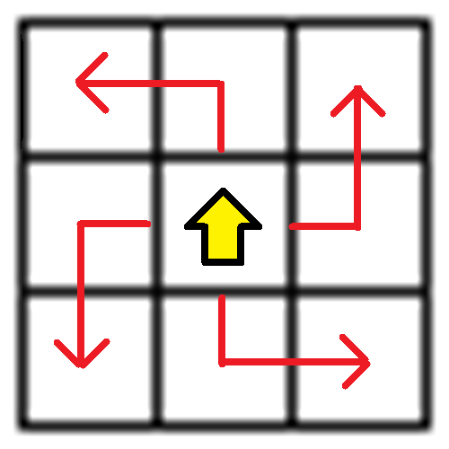
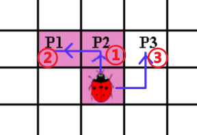
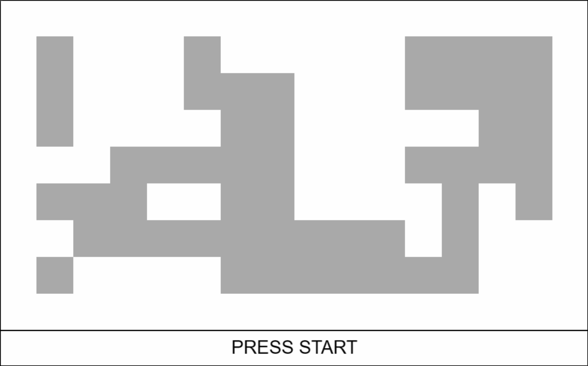
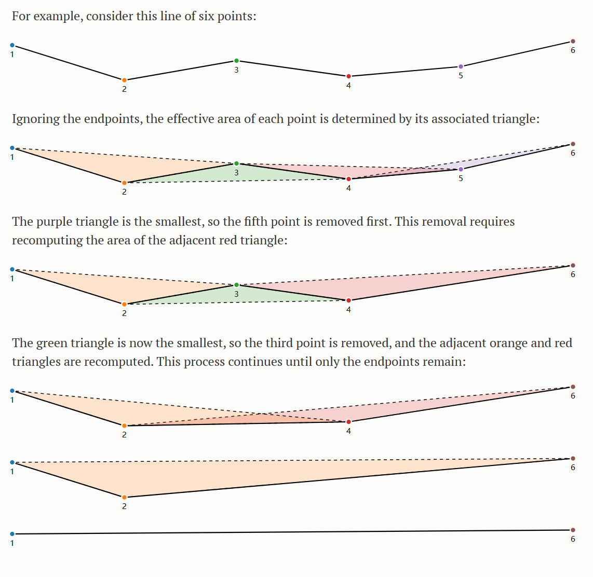
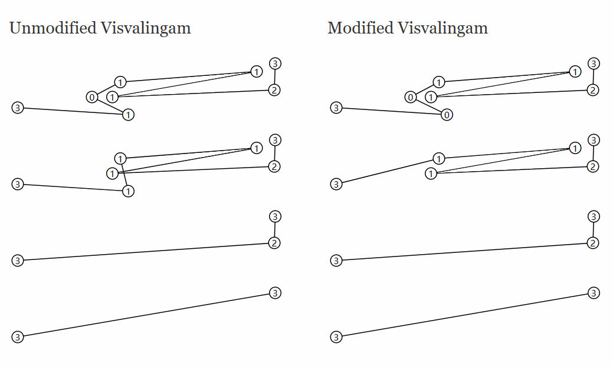
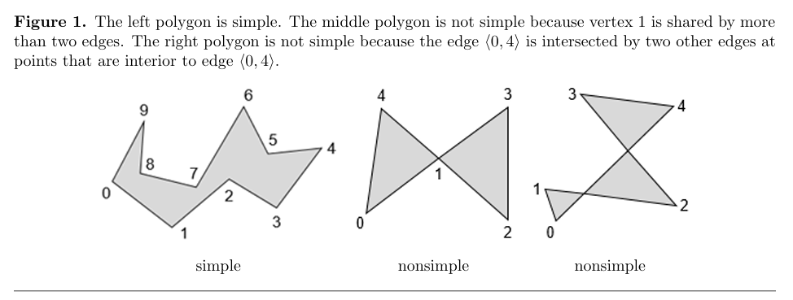
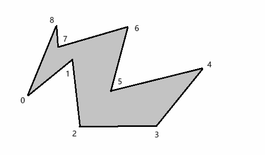
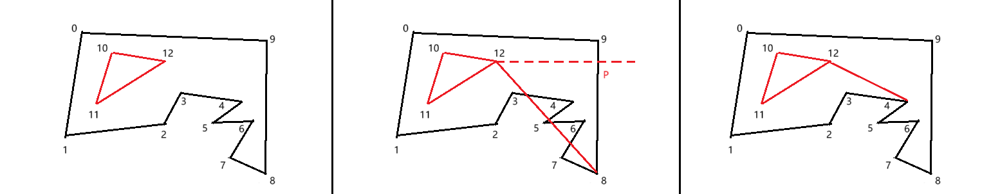

# 1.需求

利用贴图的alpha通道信息，生成一个贴合边缘的网格。

## 1.1.需求整理

这里的需求，可以细化整理为以下几个步骤：

1. 【可选】降低分辨率，先对贴图进行处理，降低后续所有流程的消耗
2. 轮廓跟踪，生成边界（顶点）信息（contour tracing）
3. 【可选】轨迹压缩，减少顶点数量
4. 三角形划分（triangulation），利用顶点数据生成三角形

# 2.轮廓跟踪

> 关键词：contour tracing

## 2.1.概念

轮廓跟踪，可以根据一组二维数据，为了对图片的信息进行简化，此处将符合要求的像素标准为1，反之标记为0，目标是获取1与0之间的分界上的顶点列表。

轮廓一般需要区分 **外轮廓** 和 **内轮廓**，默认情况下，轮廓跟踪算法只考虑外轮廓，需要对算法进行一定的调整后，也可以用来生成内轮廓。内轮廓的顶点顺序将会与外轮廓相反，即外轮廓如果使用的是逆时针，则内轮廓顶点必须是顺时针。这个规定与后续三角形划分算法的要求也有关。

获取贴图，也就是矩形单元格的轮廓，可以分为两种情况：

 - 4-connectivity：四向连接，只有上下左右四个方向有相邻的像素，才会生成连续的顶点。
 - 8-connectivity：八向连接，像素周围的8格，任意位置上有像素，都会被判定为相邻。

![[contour_tracing-2types_connectedness.png]]

> 大部分情况下四向连接的算法会更加简单。如果后续不会考虑顶点简化，其实生成的形状（总面积）也并没有区别，但如果需要对顶点进行简化，四向连接会因为顶点数组更加分散，导致最终的效果相比起八向连接更 “碎”。所以仅对于这里的这个需求，将采用八向连接的方式。

有多种轮廓跟踪算法，本文只介绍 Radial Sweep 和 Theo Pavlidis' Algorithm 两种算法。

## 2.2.Radial Sweep

Radial Sweep，径向扫描算法。是一种八向连接算法，因为对每个像素都会尝试扫过周围的8个像素，会对很多像素进行重复的判断，每个空白像素会重复判断两次。

每个循环（像素）的处理大致为：

1. 记录检查的起始方向，遍历周围的8个方向，是否有像素相连。
	1. 如果出现了像素相连。开始检测下一个连接的像素，下一个像素的初始角度，应该是当前像素所在的位置加一（外轮廓的话逆时针方向加一，内轮廓就顺时针加一）。
2. 最终结束的条件为，检测到了起始点的起始方向。

> 变体：
> 内轮廓的生成方法，只需要调整遍历周围顶点的顺序，改为顺时针。

## 2.3.Theo Pavlidis' Algorithm

Theo Pavlidis' Algorithm，是一种四向连接的算法，性能更高。

该算法的思想大概就是把周围的8个单元格进行划分，分为四个块。只要在相应的块中，找到了有像素，就说明对应边是内边；相应的，如果没有找到，则说明对应的边就是轮廓。

实际的使用中，一般是把每个判断的单元描述为，对每个面进行三个像素判断。主要的目的是**处理下一个像素判断的初始朝向，来减少重复判断。**

如上图中，是确定一个当前朝向，然后依次判断其中的 P2、P1、P3像素是否有效。其中，判断路线上经过的任意一个像素不存在则中断。比如，先判断到 P2 的像素确实存在，之后判断 P1，发现不存在，则下一个像素移动到 P2，下个像素的初始朝向是“上”；反之，则可以直接移动到 P1，下个像素的初始朝向是“左”。

> 这里 P3 的判断同样需要先判断右侧像素是否存在，只有右侧像素存在的情况下， 才会进一步去判断右上的像素是否存在。

完整的效果：

# 3.轨迹压缩

> 关键词：line Simplification，decimate curve

## 3.1.概念

轨迹压缩，是一种将由线段组成的曲线抽取为具有较少点的类似曲线的算法。该算法的目的是，给定一条由线段组成的曲线（或者叫折线），以找到具有较少点的类似曲线（摘抄自参考资料2）。可以理解为删去顶点列表中，对轮廓的形状贡献不大的顶点。

> 与顶点压缩算法的区别主要在于，处理的目标不同，轨迹压缩处理的一般是曲线，而顶点简化算法一般是指清理三角形（mesh）中的顶点。需要考虑的分别是曲线的外形变化和三角形的形状（或者说整体的体积）变化。

## 3.2.Ramer-Douglas-Peucker

在 Ramer-Douglas-Peucker 算法中，将根据原始曲线和简化曲线之间的最大距离来定义不同。

算法的思路：

对一条曲线的某部分（算法的开始是首尾端点连线），求所有点到该直线的距离，找出其中具体最大的点 `dmax`，将 `dmax` 与设置的 `epsilon` 对比：
- 如果 `dmax < epsilon`，则说明这部分曲线中间的所有顶点都可以舍去；
- 如果 `dmax >= epsilon`，则应该保留 `dmax` 所对应的索引，同时选择这个顶点作为端点，将曲线分为两个部分，对两个部分重复该方法，直到无法再进行细分（子部分顶点数小于等于2）；

## 3.3.Visvalingam’s algorithm

在 Visvalingam’s algorithm 算法中，根据每个顶点与周围顶点的面积来选择需要删除的顶点。

## 3.4.自交问题处理

在默认情况下，上面的两种算法都会遇到一个问题，也就是删除顶点后，新增的边可能与别其他边发生自交现象，进而导致轨迹压缩的结果不满足简单形状的要求。

---
二维选点判断相交的实现

设：两条线段分别为 $(p1,q1)$ 和 $(p2,q2)$。可以分为两种情况处理：

- 如果两条线段不共线，在三角形 $(p1,q1,p2)$ 和 $(p1,q1,q2)$ 顶点顺序相反，且另一组三角形 $(p2,q2,p1)$ 和 $(p2,q2,q1)$ 顶点顺序也相反，就说明两条线段不相交。
- 如果两条线段共线，则只需要判断X、Y轴上有没有公共部分即可。

## 3.5.算法对比

两种算法的基础实现基本无法拉开差距，时间和空间上的性能都基本相同，但 Visvalingam 可以使用最小堆进行优化，因此性能更佳。而 Ramer-Douglas-Peucker 算法，因为每次选择了新的起始点和终点后，所有点到线段的距离又需要重新计算，因此无法采取此优化。

因此，通常都优先选择 Visvalingam 算法。

# 4.三角形划分

> 关键词：triangulation

## 4.1.概念

此处的需求是通过轮廓来生成三角形，最常见的都是采用 Ear-Clipping 算法。

 > 此处一般不考虑 Delaunay 算法，因为 Delaunay 要区分三角形是否在轮廓范围外还需要额外的判断，相对更繁琐一些，所以这里采用更加简单的算法

此处还涉及一个 “简单形状” 的概念，它指的是<u>每个顶点只和两条边相连</u>。

## 4.2.Ear-Clipping

Ear-Clipping，有时被翻译为减耳法、折耳法。其中有一个重要的概念，<u>在简单形状中，所有突出（内夹角小于180°）且顶点与其相邻的两个顶点所组成的三角形不会包含其他顶点</u>，满足了以上条件的顶点，就被称为 “耳”。Ear-Clipping 算法就是逐步找出形状中的所有 “耳”，作为三角形，直到形状的顶点不足以继续划分多个三角形。

### 4.2.1.基础实现

在不考虑内轮廓的情况下，基础逻辑就是遍历所有顶点，直到顶点数量小于等于3。

- 对每个顶点判断与相邻两个顶点所组成的方向，如果方向为正方向（比如逆时针），则顶点满足突出顶点的要求；否则，跳过当前顶点，继续遍历。
- 判断组成的三角形内是否包含其他的任意顶点，如果不包含，则满足 ”耳“ 的定义，删除当前顶点，并记录三角形；否则，不满足，继续遍历。

### 4.2.2.含内轮廓的实现

> **注意**
> 为了保证多个轮廓列表合并后表现正常，要求每层轮廓和上层轮廓的顺序相反。比如，外层轮廓是逆时针，则内轮廓就该顺时针，内轮廓的内轮廓又该是逆时针。

在考虑内轮廓的情况下，这里的处理思路是，将多个轮廓合并为一个整体。实现的思路如下：

1. 找出内轮廓在某个方向上最远的顶点（设为顶点 $p$）。是为了避免与内轮廓的其他顶点进行判断。
2. 在顶点 $p$ 沿设定的方向发射一条射线，必定命中外轮廓的一条边，设命中的点为 $i$，设命中的轮廓边起始点为 $m$。
3. 连接三个顶点，得到三角形 $\Delta pim$ ，判断三角形内是否包含其他顶点 如果三角形内不包含其他顶点，说明顶点 $p$ 到顶点 $m$ 可见； 如果三角形内包含了其他顶点，则说明顶点 $p$ 到顶点 $m$ 不可见。找出其中与射线 $\vec{pi}$ 夹角最小的顶点，这个顶点才是顶点 $p$ 的可见顶点。
4. 连接顶点 $p$ 和可见顶点。此处为了保持形状仍然满足简单形状的要求，需要额外增加一组顶点。

如上图，首先找出内轮廓顶点中，（此处选择）X最大的点12，沿着X轴方向发射射线，与外轮廓的8、9发生相交，交点设为点 $p$，连接顶点 8、$p$、12。发现三角形包含了顶点4、6，遍历发现其中顶点12到顶点4的射线与X轴夹角最小，说明顶点4是顶点12的可见点。说明内轮廓与外轮廓的连线就是4~12。

此处为了保证仍然满足简单形状，因此连接后的顶点顺序应该为（节选顶点3~5）：
3、4、12、11、10、12、4、5

# 参考资料

1. [Contour Tracing (imageprocessingplace.com)](https://www.imageprocessingplace.com/downloads_V3/root_downloads/tutorials/contour_tracing_Abeer_George_Ghuneim/alg.html)
2. [Ramer-Douglas-Peucker 算法 - 维基百科，自由的百科全书](https://en.wikipedia.org/wiki/Ramer%E2%80%93Douglas%E2%80%93Peucker_algorithm)
3. [04. 矢量瓦片地图线化简算法研究 - 风帆远航 - 博客园 (cnblogs.com)](https://www.cnblogs.com/flying-birds-xyg/p/16001311.html)
4. [TriangulationByEarClipping](https://www.geometrictools.com/Documentation/TriangulationByEarClipping.pdf)