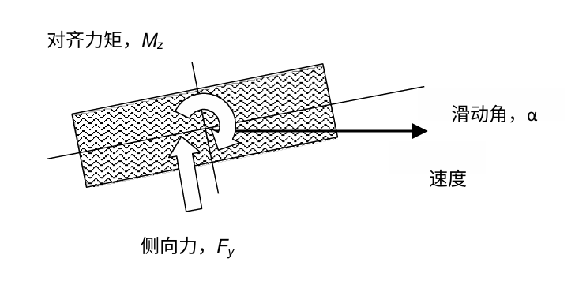

# 1.基础概念

载具相关，常见的名词解释，阅读相关的代码时经常会遇到：

> 相关概念的解释节选自 wikipedia vehicle dynamic 车辆动力学

1. **车架**（chassis）<br>车辆的主体部分，通常不会发生形变，用来模拟车辆的平移和旋转。
2. **轮胎**（与质量相关的逻辑通常用wheel，与摩擦相关的通常用tire/tyre）<br>对车辆运动影响最大的因素，车辆的最终动力输出，直接影响到车辆的行驶状态。
3. **悬挂**（suspension）<br>车辆的避震结构，利用有阻尼的弹簧（或类似）系统来减少震荡。
4. **传动系统**（也可以叫动力系统）<br>包括发动机、变速箱、差速器等一系列结构在内，将来自发动机的扭矩最终作用到车轮上实现动力输出。

## 1.1.建模

在经过了大量的简化后，可以对一个载具系统建模为：

```plantuml
start
:收集数据信息;
note right
当前油门大小、挡位等
end note
:更新当前的输出的动力;
while (遍历车轮)
:更新当前车轮上输出的扭矩;
:更新悬挂状态;
if (车轮与其他物体有接触) then (true)
:动力输出;
else (false)
endif
endwhile
:根据悬挂传递的力，更新车架姿态;
end
```

## 1.2.名词补充

- tire model<br>轮胎模型，更加仿真的车辆模拟中，为了更加还原现实中不同状况下，车轮输出的各种力。现实中的轮胎在加速、制动和转弯时，与地面会产生不同表现的形变，因此不同状态产生的力也各不相同。<br>
	- longitudinal force 纵向力<br>沿着当前车轮前进方向的力
	- lateral force 侧向力<br>垂直于当前车轮前进方向的力，会导致车轮有翻转的趋势
- 

# 特殊名词记录

lat = lateral，侧面，在PhysX Vehicle中，`eNORM_TIRE_LAT_FORCE` 表示的就是归一化之后的横向力
long = longitudinal，纵向
magnitude，幅度

# 涉及的公式

1. **力学定律**
   - **牛顿第二定律**： $F = m \cdot a$ , 其中 $F$ 是作用力的大小，$m$ 是物体的质量，$a$ 是加速度。
   - **牛顿第三定律**（反作用力定律）：
     - 对于一个点或物体来说，它与外部作用力相互作用时，其加速度等于所有作用在它上的力的总和除以其质量。

2. **能量守恒原理**
   - **机械能守恒**：$E_{kin} + E_{pot} = \text{const}$，其中 $E_{kin}$ 是动能，$E_{pot}$ 是潜在能。

3. **运动学**
   - **三角函数**（用于描述转向）：使用三角函数如正弦、余弦和切线来表示车辆的转向角度。
   - **四元数或欧几里群论**：用于描述旋转运动，特别是在模拟转向时。

4. **控制理论**
   - **PID控制器**：比例、积分、微分控制算法用以调整系统行为。它们通常以以下形式表示：
     - $\left[u(t) = K_p \cdot e(t) + K_i \int_0^t e(\tau) d\tau + K_d \frac{de}{dt} \right]$
       其中 $u$ 是控制输出，$e$ 是误差，$K_p$、$K_i$ 和 $K_d$ 分别是比例、积分和微分参数。

5. **动力学**
   - **新托尼公式**：对于振荡系统，可以使用这个近似公式来表示振幅与频率的关系：
     - $\left[a = \cfrac{1}{2\pi} \cdot \cfrac{\omega_0^2}{\sqrt{k/m}} \right]$
       其中 $a$ 是振幅，$\omega_0$ 是自震角速度，$k$ 是弹性常数（如悬挂刚度），$m$ 是质量。

6. **摩擦力和阻力**
   - **库伦定律**：描述静止摩擦系数：
     - $\left[f_s = \mu_s \cdot N\right]$
       其中 $f_s$ 是静止摩擦力，$\mu_s$ 是静止摩擦系数，$N$ 是垂直作用力。
   - **斯图加定律**：描述滑动摩擦系数：
     - $\left[f_k = \mu_k \cdot N\right]$
       其中 $f_k$ 是滑动摩擦力，$\mu_k$ 是滑动摩擦系数。

7. **热力学**
   - **牛顿-库尔的法则**：描述引擎效率：
     - $\left[e = \cfrac{W_{out}}{W_{in}}\right]$
       其中 $e$ 是效率，$W_{out}$ 是输出功率，$W_{in}$ 是输入功率。

这些是模拟载具运行时可能会涉及的物理和数学公式。具体应用还需要考虑到所使用的编程语言、模拟软件或工程环境的特定要求。

1. **Hooke's Law**：库洛定律，如果考虑车轮与地面之间的垂直力矩（即轮胎负荷），可以使用Hookes定律来描述材料刚性的特性：
   $\sigma  = E  \epsilon$
   where:
   - $\sigma$ is the stress in the material (force per unit area)
     -  \( E  \) is Young's modulus (material stiffness)
     -  \( \epsilon  \) is strain (deformation per unit length)

2. **Coulomb Friction Model**：库仑摩擦模型，对于轮胎与地面之间的摩擦力，可以使用库仑摩擦模型。这个模型涉及到正弦函数，根据轮胎与
地面的接触角度来确定摩擦力的大小：
   \( F_m  = \mu  \times N  \)
   where:
   - \( F_m  \) is the frictional force
     -  \( \mu  \) is the coefficient of static or kinetic friction
     -  \( N  \) is the normal force (perpendicular to the contact area)

3. **Elastic Foundation Model**：弹性支承模型，这可以被用于模拟轮胎与地面的弹性接触：
   \( F_z = k_c \times z + b_c \times z^2 \)
   where:
   - \( F_z  \) is the vertical force exerted by the tire on the ground
     -  \( k_c, b_c  \) are coefficients that determine the stiffness and non-linearity of the contact

4. **Contact Stress Model**：接触压力模型，如果需要更精确的接触压力计算，可以使用Hertz或其他类似的接触模型：
   \( P_{contact} = \sqrt{3K} \times \left( \frac{F_z}{\pi a^2} \right) \)
   where:
   -  \( K  \) is the modulus of elasticity for the contact materials
     -  \( a  \) is the radius of the tire footprint

# 1.基础概要

## 实时物理载具模拟系统入门介绍

# 1. 对载具的抽象

在物理模拟中，通常会将现实中的载具抽象为以下几个部分：
 1. **车架**：<br>车辆的主题部分被视作一个整体，不会发生形变（默认情况没考虑碰撞变形，应该是另外的方式处理的，比如替换模型）。用来模拟车辆整体的运动，平移和旋转。
 2. **轮胎模型**：<br>对车辆运动影响影响最大的因素，将轮胎与地面的接触点视作弹性和摩擦力的来源。在PhysX Vehicle中，默认使用的模型是来自 `CarSimEd` 文档附录中讨论的轮胎模型[^1]。其他的工程仿真中常见的轮胎模型还有 `Pacejka` 轮胎模型。
 3. **悬挂系统**：<br>现实中的悬挂系统通常被简化为一组弹簧-阻尼器系统，用来模拟车辆的弹跳避震效果。
 4. **动力系统**：<br>对现实中，发动机通过一系列传动系统，将动力传输到车轮这一过程进行简化。

# 2.对载具系统建模


## 2.1.不考虑悬挂系统

### 一、概述

实时物理载具模拟系统是一种利用物理学原理和数学模型，对现实中的车辆进行模拟的系统。该系统广泛应用于游戏开发、训练模拟、自动驾驶研究等领域。通过这种模拟，可以在虚拟环境中精确地再现车辆的运动行为，从而为用户提供逼真的体验和实验平台。

### 二、载具的抽象

在物理模拟中，现实中的载具通常会被抽象为一系列简化的物理模型。以下是一些主要的抽象方式：

1. **刚体模型**：车辆被视为刚体，这意味着车辆的各个部分保持相对固定，不会发生形变。刚体模型主要用于模拟车辆的整体运动，如平移和旋转。
2. **质心与质量分布**：车辆的质量被集中于质心，同时考虑车辆的质量分布（惯性张量），以便准确模拟车辆的转动惯性。
3. **轮胎模型**：轮胎与地面的接触点被视为弹性和摩擦力的来源。常用的轮胎模型包括Fiala模型和Pacejka魔术公式。
4. **悬挂系统**：悬挂系统被简化为一系列弹簧-阻尼器系统，用于模拟车辆的悬挂和减震效果。
5. **动力系统**：动力系统（如发动机和传动系统）被简化为一系列输入-输出关系，描述动力如何从发动机传递到车轮。

### 三、载具系统的建模

建模载具系统需要考虑多个方面，包括力学模型、运动学模型和控制模型。以下是一些核心物理公式和模型：

1. **牛顿第二定律**：
    
    $$F=ma$$
    
    其中，$F$ 是作用在载具上的合力，$m$ 是车辆的质量，$a$ 是车辆的加速度。
    
2. **刚体动力学**：
    
    $$I\cfrac{d\omega}{dt}=\tau$$
    
    其中，$I$ 是惯性张量，$\omega$ 是角速度，$\tau$ 是合外力矩。用于模拟车辆的旋转运动。
    
3. **轮胎力学**：
	- **Pacejka魔术公式**（用于计算轮胎力）：
        $$F = D \sin(C\arctan(B\alpha))$$
        
        其中，$F$​ 是侧向力，$\alpha$ 是侧偏角，$B$、$C$、$D$ 是模型参数。
    - **Fiala模型**（用于计算侧向力和纵向力）：

4. **悬挂系统**：
    $$\begin{aligned}F_{spring}&=-k\Delta{x}\\F_{damping}&=-c\cfrac{dx}{dt}\end{aligned}$$
    
    其中，$F_{spring}$ 是弹簧力，$k$ 是弹簧常数，$\Delta{x}$ 是弹簧的位移；$F_{damping}$​ 是阻尼力，$c$ 是阻尼系数，$\frac{dx}{dt}$ 是速度。
    
5. **动力系统**：
	$$\begin{aligned}P&=T\omega\\T&=\cfrac{P}{\omega}\end{aligned}$$
    
    其中，$P$ 是功率，$T$ 是扭矩，$\omega$ 是角速度。
    

#### 四、总结

实时物理载具模拟系统通过对载具的物理属性进行抽象和建模，能够在虚拟环境中逼真地再现车辆的运动行为。核心的物理模型包括刚体动力学、轮胎力学、悬挂系统和动力系统等。通过应用这些模型，可以为用户提供高度真实的驾驶体验，并支持各种研究和开发需求。
# 参考资料

1. [车辆动力学 - 维基百科，自由的百科全书 --- Vehicle dynamics - Wikipedia](https://en.m.wikipedia.org/wiki/Vehicle_dynamics)


[^1]: by PhysX Vehicle 5.3.1 references https://nvidia-omniverse.github.io/PhysX/physx/5.3.1/docs/Vehicles.html#references